[](https://github.com/namastack/namastack-outbox/releases/tag/v1.0.0-RC1)
[](https://www.codefactor.io/repository/github/namastack/namastack-outbox)
[](https://codecov.io/github/namastack/namastack-outbox)
[](https://javadoc.io/doc/io.namastack/namastack-outbox-core)
[](https://github.com/namastack/namastack-outbox/actions/workflows/gradle-test.yml)
[](https://github.com/namastack/namastack-outbox/releases/latest)
[](https://github.com/namastack/namastack-outbox/commits/main)
[](https://img.shields.io/badge/dependabot-enabled-025E8C?logo=dependabot&logoColor=white)
[](https://opensource.org/licenses/Apache-2.0)

# Namastack Outbox for Spring Boot

A robust Spring Boot library for **Java and Kotlin** projects that implements the 
**Transactional Outbox Pattern** for reliable record publishing in distributed systems. Ensures 
records are never lost through atomic persistence and automatic retry logic
with handler-based processing and partition-aware horizontal scaling.

## Key Features

- ✅ **Transactional Atomicity**: Records saved in same transaction as domain data
- ✅ **Zero Message Loss**: Database-backed with at-least-once delivery
- ✅ **Horizontal Scaling**: Automatic partition assignment across instances
- ✅ **Automatic Retry**: Exponential backoff, fixed delay, or jittered policies
- ✅ **Handler-Based**: Annotation-based or interface-based handler registration
- ✅ **Type-Safe Handlers**: Generic or typed handler support
- ✅ **Fallback Handlers**: Graceful degradation when retries are exhausted
- ✅ **Flexible Payloads**: Store any type - events, commands, notifications, etc.
- ✅ **Context Propagation**: Trace IDs, tenant info, correlation IDs across async boundaries
- ✅ **Ordered Processing**: Records with same key processed sequentially
- ✅ **Built-in Metrics**: Micrometer integration for monitoring

---

## 📖 Documentation

For detailed information about features, configuration, and advanced topics, visit the **[complete documentation](https://outbox.namastack.io)**.

Quick links:
- [API Reference (Javadoc)](https://javadoc.io/doc/io.namastack/namastack-outbox-api)
- [GitHub Issues](https://github.com/namastack/namastack-outbox/issues)
- [GitHub Discussions](https://github.com/namastack/namastack-outbox/discussions)

---

## 🚀 Quick Start (5 Minutes)

### 1. Add Dependency

**Gradle (Kotlin DSL):**

```gradle
dependencies {
    implementation("io.namastack:namastack-outbox-starter-jpa:1.0.0-RC1")
}
```

**Maven:**

```xml
<dependency>
    <groupId>io.namastack</groupId>
    <artifactId>namastack-outbox-starter-jpa</artifactId>
    <version>1.0.0-RC1</version>
</dependency>
```

### 2. Enable Outbox

```kotlin
@SpringBootApplication
@EnableOutbox
@EnableScheduling  // Required for automatic outbox processing
class Application

fun main(args: Array<String>) {
    runApplication<Application>(*args)
}
```

### 3. Create Handlers

```kotlin
@Component
class OrderHandlers {
    // Typed handler - processes specific payload type
    @OutboxHandler
    fun handleOrder(payload: OrderCreatedRecord) {
        eventPublisher.publish(payload)
    }
    
    // Generic handler - processes any payload type
    @OutboxHandler
    fun handleAny(payload: Any, metadata: OutboxRecordMetadata) {
        when (payload) {
            is OrderCreatedRecord -> eventPublisher.publish(payload)
            is PaymentProcessedEvent -> paymentService.process(payload)
            else -> logger.warn("Unknown payload type")
        }
    }
}
```

### 4. Schedule Records Atomically

```kotlin
@Service
class OrderService(
    private val outbox: Outbox,
    private val orderRepository: OrderRepository
) {
    @Transactional
    fun createOrder(command: CreateOrderCommand) {
        val order = Order.create(command)
        orderRepository.save(order)
        
        // Schedule event - saved atomically with the order
        outbox.schedule(
            payload = OrderCreatedEvent(order.id, order.customerId),
            key = "order-${order.id}"  // Groups records for ordered processing
        )
    }
}
```

**Alternative: Using Spring's ApplicationEventPublisher**

If you prefer Spring's native event publishing, annotate your events with `@OutboxEvent`:

```kotlin
@OutboxEvent(
    key = "#this.orderId",  // SpEL: uses 'orderId' field
    context = [
        OutboxContextEntry(key = "customerId", value = "#this.customerId"),
        OutboxContextEntry(key = "region", value = "#this.region")
    ]
)
data class OrderCreatedEvent(
    val orderId: String,
    val customerId: String,
    val region: String,
    val amount: BigDecimal
)

@Service
class OrderService(
    private val orderRepository: OrderRepository,
    private val eventPublisher: ApplicationEventPublisher
) {
    @Transactional
    fun createOrder(command: CreateOrderCommand) {
        val order = Order.create(command)
        orderRepository.save(order)
        
        // Publish event - automatically saved to outbox atomically
        eventPublisher.publishEvent(
            OrderCreatedEvent(order.id, order.customerId, order.region, order.amount)
        )
    }
}
```

Both approaches work equally well. Choose based on your preference:
- **Explicit `outbox.schedule()`**: More control, clearer intent, supports any payload type
- **`@OutboxEvent` + `ApplicationEventPublisher`**: More Spring idiomatic for domain events

### 5. Configure (Optional)

```yaml
outbox:
  poll-interval: 2000
  batch-size: 10
  retry:
    policy: "exponential"
    max-retries: 3
    exponential:
      initial-delay: 1000
      max-delay: 60000
      multiplier: 2.0
```

For a complete list of all configuration options, see [Configuration Reference](https://outbox.namastack.io/features/#configuration-reference).

**That's it!** Your records are now reliably persisted and processed.

---

## Features

### Handlers

Process outbox records using annotation-based handlers:

```kotlin
@Component
class MyHandlers {
    // Typed handler - processes specific payload type
    @OutboxHandler
    fun handleOrder(payload: OrderCreatedEvent) {
        println("Processing order: ${payload.orderId}")
    }

    // Generic handler - processes any payload type
    @OutboxHandler
    fun handleAny(payload: Any, metadata: OutboxRecordMetadata) {
        when (payload) {
            is OrderCreatedEvent -> handleOrder(payload)
            is PaymentProcessedEvent -> handlePayment(payload)
            else -> logger.warn("Unknown payload: ${payload::class.simpleName}")
        }
    }
}
```

**Handler Invocation Order:**
1. All matching typed handlers (in registration order)
2. All generic handlers (catch-all)

For interface-based handlers, see [Handler Documentation](https://outbox.namastack.io/features/).

---

### Fallback Handlers

Gracefully handle permanently failed records after all retries are exhausted.

```kotlin
@Component
class OrderHandlers {
    @OutboxHandler
    fun handleOrder(payload: OrderEvent) {
        emailService.send(payload.email)  // May fail
    }

    @OutboxFallbackHandler
    fun handleOrderFailure(payload: OrderEvent, context: OutboxFailureContext) {
        // Invoked when handleOrder fails permanently
        logger.error("Order ${payload.orderId} failed after ${context.failureCount} attempts")
        deadLetterQueue.publish(payload)
    }
}
```

**Features:**
- Automatic invocation when retries exhausted or non-retryable exceptions occur
- Automatically matched by payload type
- Access to failure details and metadata via `OutboxFailureContext`
- Record marked COMPLETED if fallback succeeds

For interface-based fallback handlers, see [Fallback Documentation](https://outbox.namastack.io/features/).

---

### Context Propagation

Preserve context (trace IDs, tenant info, correlation IDs) across async boundaries.

```kotlin
@Component
class TracingContextProvider(
    private val tracer: Tracer
) : OutboxContextProvider {
    override fun provide(): Map<String, String> {
        val currentSpan = tracer.currentSpan() ?: return emptyMap()
        return mapOf(
            "traceId" to currentSpan.context().traceId(),
            "spanId" to currentSpan.context().spanId()
        )
    }
}
```

**Accessing Context in Handlers:**

```kotlin
@Component
class OrderHandler {
    @OutboxHandler
    fun handle(payload: OrderEvent, metadata: OutboxRecordMetadata) {
        // Access context via metadata.context
        val traceId = metadata.context["traceId"]
        val tenantId = metadata.context["tenantId"]
        
        logger.info("Processing order ${payload.orderId} [trace: $traceId]")
    }
    
    @OutboxFallbackHandler
    fun handleFailure(payload: OrderEvent, failureContext: OutboxFailureContext) {
        // Access context via failureContext.context
        val traceId = failureContext.context["traceId"]
        
        deadLetterQueue.publish(payload, mapOf("traceId" to traceId))
    }
}
```

**Features:**
- Automatic context capture during `outbox.schedule()`
- Context available via `metadata.context` in handlers
- Context available via `failureContext.context` in fallback handlers
- Multiple providers supported (merged automatically)
- Supports distributed tracing, multi-tenancy, correlation IDs

For complete documentation and examples, see [Context Propagation Documentation](https://outbox.namastack.io/features/).

---

### Retry Policies

Configure retry behavior in `application.yml` to set the **default policy for all handlers**.

**Exponential Backoff (Recommended):**

```yaml
outbox:
  retry:
    policy: exponential
    max-retries: 3
    exponential:
      initial-delay: 1000      # 1 second
      max-delay: 60000         # 1 minute
      multiplier: 2.0
    # Optional: Control which exceptions trigger retries
    include-exceptions:
      - java.net.SocketTimeoutException
      - org.springframework.web.client.ResourceAccessException
    exclude-exceptions:
      - java.lang.IllegalArgumentException
      - javax.validation.ValidationException
```

Delays: 1s → 2s → 4s → 8s → 16s → 32s → 60s (capped)

**Fixed Delay:**

```yaml
outbox:
  retry:
    policy: fixed
    max-retries: 5
    fixed:
      delay: 5000              # Always 5 seconds
```

**Jittered (Prevents Thundering Herd):**

```yaml
outbox:
  retry:
    policy: jittered
    max-retries: 4
    jittered:
      base-policy: exponential
      jitter: 1000             # ±0-1000ms random
```

**Custom Retry Policies:**

Override the default policy globally or per handler:

```kotlin
// Global custom policy - replaces default for all handlers
@Component
class CustomRetryPolicy : OutboxRetryPolicy {
    override fun shouldRetry(exception: Throwable): Boolean {
        return when (exception) {
            is InvalidCredentialsException -> false
            is TemporaryNetworkException -> true
            else -> true
        }
    }

    override fun nextDelay(failureCount: Int) = Duration.ofSeconds(5)
    override fun maxRetries() = 3
}

// Per-handler override using @OutboxRetryable
@Component  
class PaymentHandler {
    @OutboxHandler
    @OutboxRetryable(AggressiveRetryPolicy::class)
    fun handle(payload: PaymentEvent) {
        paymentGateway.process(payload)
    }
}

@Component
class AggressiveRetryPolicy : OutboxRetryPolicy {
    override fun shouldRetry(exception: Throwable) = true
    override fun nextDelay(failureCount: Int) = Duration.ofMillis(500)
    override fun maxRetries() = 10
}
```

---

## How It Works

### The Pattern

The Transactional Outbox Pattern ensures reliable message delivery by persisting outbox records in the same database transaction as your business data. This guarantees atomicity - either both succeed or both fail together.

**Flow Overview:**

```mermaid
graph TD
    A[Application saves Business Entity + schedules Outbox Record] -->|Atomic transaction| B[Record persisted to outbox_record table<br/>One record per handler, with context]
    B --> C[Background scheduler polls for unprocessed records]
    C -->|queries records ready for processing| D[Scheduler invokes registered handlers]
    D -->|typed → generic| E{Handler execution}
    E -->|Success| F[Record marked COMPLETED]
    E -->|Exception thrown| G[Scheduled for retry with backoff]
    G -->|calculates next retry time| H{Retries remaining?}
    H -->|Yes| C
    H -->|No - Max retries exceeded| I{Fallback handler registered?}
    I -->|Yes| J[Invoke fallback handler]
    I -->|No| K[Record marked FAILED]
    J -->|Success| F
    J -->|Exception| K
```



**Key Guarantees:**

- **Atomicity**: Outbox record is saved in the same transaction as your domain data. No separate transaction means no risk of inconsistency.
- **At-Least-Once Delivery**: Records are processed at least once, but may be processed multiple times if failures occur. Make your handlers idempotent.
- **Ordering**: Records with the same `key` are processed sequentially by the same instance. This ensures correct ordering for related records.
- **Automatic Retry**: Failed records are automatically retried based on the configured retry policy. No manual intervention needed for transient failures.
- **Graceful Degradation**: Fallback handlers provide a safety net when all retries are exhausted, allowing for compensating actions or dead letter queue publishing.

### Partitioning & Scaling

The library uses consistent hashing to distribute records across multiple instances, enabling horizontal scaling while maintaining ordering guarantees.

**Partition Assignment:**

Each instance is assigned a subset of 256 partitions. Records are assigned to partitions based on a hash of their `key`:

```
Instance 1 → partition 0-84   → handles "order-123", "order-456"
Instance 2 → partition 85-169 → handles "payment-789", "customer-001"
Instance 3 → partition 170-255 → handles other keys
```

**Key-Based Ordering:**

Records with the same `key` always hash to the same partition, ensuring they're processed by the same instance in order:

```
Key "order-123" → partition 42 → Instance 1
Key "order-123" → partition 42 → Instance 1  (same partition, same order)
Key "order-456" → partition 78 → Instance 1
Key "payment-789" → partition 142 → Instance 2
```

**Automatic Rebalancing:**

When an instance fails or a new instance joins, partitions are automatically reassigned:

```
Before (3 instances):
Instance 1 → partitions 0-84
Instance 2 → partitions 85-169
Instance 3 → partitions 170-255

Instance 2 fails:
Instance 1 → partitions 0-127      (takes over half of Instance 2's partitions)
Instance 3 → partitions 128-255    (takes over other half)

New Instance 4 joins:
Instance 1 → partitions 0-63
Instance 3 → partitions 64-127
Instance 4 → partitions 128-191
Instance 5 → partitions 192-255
(Partitions redistributed evenly)
```

**Stale Instance Detection:**

Each instance sends periodic heartbeats. If an instance stops sending heartbeats (crash, network partition), it's marked as stale and its partitions are reassigned to healthy instances. This ensures no records are left unprocessed.

**Processing Isolation:**

Each instance only processes records from its assigned partitions. This prevents duplicate processing and ensures clean separation of work across the cluster.

---

## Monitoring

### Metrics (via Micrometer)

```yaml
management:
  endpoints:
    web:
      exposure: include=metrics,health
```

Available metrics:

```
outbox.records.count{status="new|failed|completed"}
outbox.partitions.assigned.count
outbox.partitions.pending.records.total
outbox.partitions.pending.records.max
```

---

## Supported Databases

Any JPA-compatible database is supported. Automatic schema creation is currently available for:

- ✅ H2 (development)
- ✅ MySQL / MariaDB
- ✅ PostgreSQL
- ✅ SQL Server

---

## What's New in 1.0.0-RC1

### 🎯 Fallback Handlers (GH-127, GH-128)

Add graceful degradation for permanently failed records:

```kotlin
@OutboxFallbackHandler
fun handleFailure(payload: OrderEvent, context: OutboxFailureContext) {
    deadLetterQueue.publish(payload)
}
```

**Features:**
- Automatic invocation after retries exhausted or non-retryable exceptions
- Automatic matching by payload type
- Access to failure context (retry count, exception, etc.)
- Records marked COMPLETED if fallback succeeds
- Shared fallbacks for multiple handlers

**See:** [Fallback Handlers](#fallback-handlers)

### 🔗 Context Propagation (GH-115, GH-129)

Preserve context across async boundaries:

```kotlin
@Component
class TracingContextProvider : OutboxContextProvider {
    override fun provide(): Map<String, String> {
        return mapOf(
            "traceId" to getCurrentTraceId(),
            "spanId" to getCurrentSpanId()
        )
    }
}
```

**Features:**
- Automatic context capture during `outbox.schedule()`
- Context restoration in handlers via `metadata.context`
- Support for tracing, tenancy, correlation IDs
- Multiple providers with automatic merging
- Available in both primary and fallback handlers

**See:** [Context Propagation](#context-propagation)

### 📊 Handler-Specific Retry Policies (GH-101)

Custom retry behavior per handler:

```kotlin
@Component
class PaymentHandler {
    @OutboxHandler
    @OutboxRetryable(AggressiveRetryPolicy::class)
    fun handle(payload: PaymentEvent) {
        paymentGateway.process(payload)
    }
}

@Component
class AggressiveRetryPolicy : OutboxRetryPolicy {
    override fun shouldRetry(exception: Throwable) = true
    override fun nextDelay(failureCount: Int) = Duration.ofSeconds(1)
    override fun maxRetries() = 10
}
```

**See:** [Retry Policies](#retry-policies)

---

## Migration Guide

### Migrating to 1.0.0-RC1

Version 1.0.0-RC1 introduces breaking schema changes. **You must drop and recreate the outbox tables.**

**Database Schema Changes:**

The database schema has been updated to support new features (fallback handlers, context propagation, handler-specific retry policies). All outbox tables must be recreated.

```sql
-- Drop existing tables (process or backup pending records first!)
DROP TABLE IF EXISTS outbox_record CASCADE;
DROP TABLE IF EXISTS outbox_instance CASCADE;
DROP TABLE IF EXISTS outbox_partition CASCADE;

-- New schema is auto-created on next startup
-- (if outbox.schema-initialization.enabled=true)
```

**Migration Steps:**

1. **Before upgrading**: 
   - Process all pending records OR
   - Backup `outbox_record` table if you need audit trail OR
   - Accept data loss for pending records

2. **Upgrade**:
   ```gradle
   dependencies {
       implementation("io.namastack:namastack-outbox-starter-jpa:1.0.0-RC1")
   }
   ```

3. **Drop old tables**: Execute the SQL above to drop all outbox tables

4. **Restart application**: New schema with updated columns is auto-created

**What's New in Schema:**
- Support for context propagation (new `context` column)
- Enhanced failure tracking for fallback handlers
- Optimized indexes for partition-based queries

**API Compatibility:**
- ✅ No breaking changes in handler APIs (0.4.x handlers work as-is)
- ✅ No breaking changes in `Outbox.schedule()` API
- ✅ All existing features remain backward compatible

## Version Stability & Semantic Versioning:**

From **1.0.0 onwards**, Namastack Outbox follows strict **semantic versioning**:

- **Major versions (x.0.0)**: Breaking changes allowed
  - API changes, schema changes, behavior changes
  - Migration guide provided for each major version
  
- **Minor versions (1.x.0)**: New features, backward compatible
  - New APIs, new features, enhancements
  - No breaking changes, safe to upgrade
  
- **Patch versions (1.0.x)**: Bug fixes only
  - Bug fixes, security patches
  - No new features, no breaking changes

**Pre-1.0.0 Versions:**
- Versions before 1.0.0 (0.x.x) were under active development
- Breaking changes could occur between minor versions
- Database schema changes required table recreation

**1.0.0-RC1 Status:**
- This is a **Release Candidate** for the stable 1.0.0 release
- API is locked and stable (no breaking changes expected until 2.0.0)
- Production-ready with comprehensive testing
- Only bug fixes and documentation updates until 1.0.0 GA

**What This Means for You:**
- ✅ Safe to use in production from 1.0.0-RC1 onwards
- ✅ Upgrade within same major version without fear of breaking changes
- ✅ Clear migration path when major versions are released
- ✅ Predictable release cycle and stability guarantees

---

## Requirements

- Java 17+
- Spring Boot 4.0.0+
- Kotlin 2.2+ (optional, Java is fully supported)

---

## Support

- 📖 [Documentation](https://outbox.namastack.io)
- 🐛 [Issues](https://github.com/namastack/namastack-outbox/issues)
- 💬 [Discussions](https://github.com/namastack/namastack-outbox/discussions)
- 📦 [Example Projects](namastack-outbox-examples)

---

## License

Apache License 2.0 - See [LICENSE](./LICENSE)

---

## Acknowledgments

- Built with ❤️ by [Namastack](https://namastack.io)
- Inspired by the [Transactional Outbox Pattern](https://microservices.io/patterns/data/transactional-outbox.html)
- Powered by Spring Boot & Kotlin
