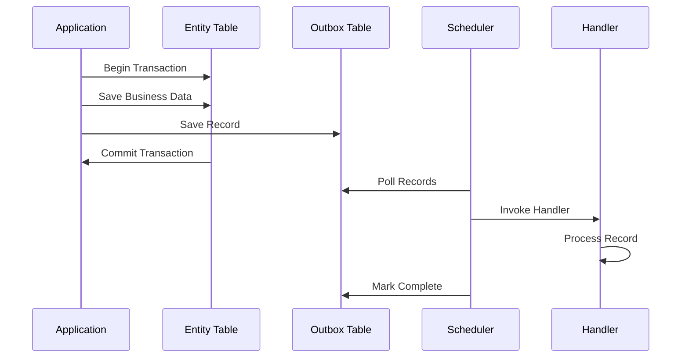
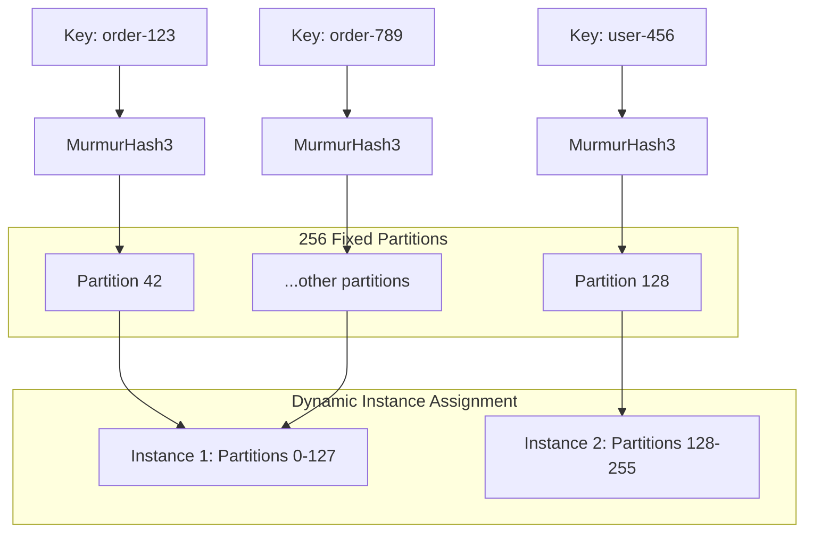
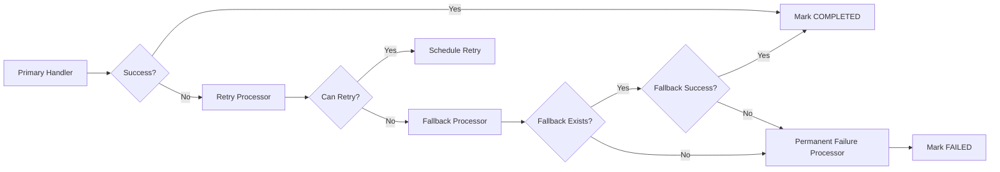
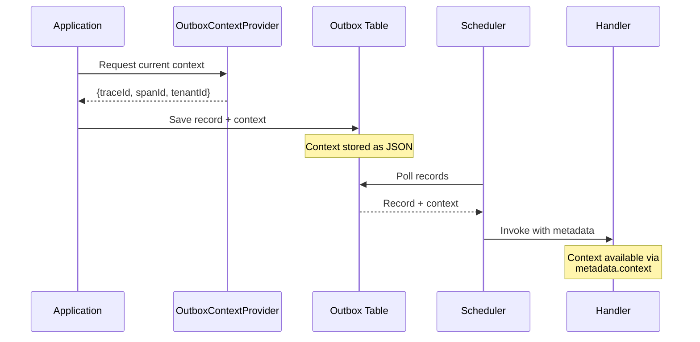
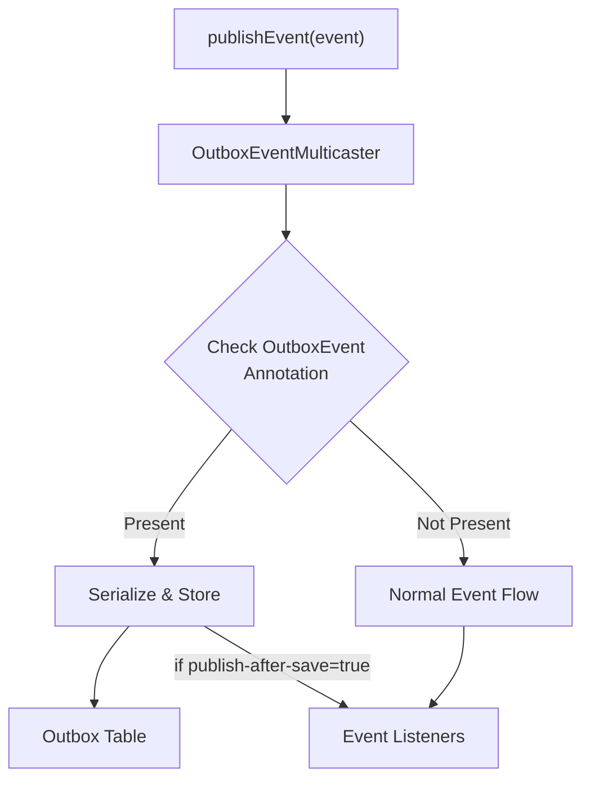

# Features

Namastack Outbox for Spring Boot provides a comprehensive set of features to implement the Outbox 
Pattern in distributed systems with reliability, scalability, and ease of use.

## Core Features

### Transactional Outbox Pattern

!!! success "Zero Message Loss"
    The library ensures that domain records are **never lost** by storing them in the same database transaction as your business data. This guarantees consistency between your domain state and persisted records.

#### Benefits

- **ACID Compliance**: Records are saved atomically with business data
- **Consistency Guarantee**: No partial updates or lost records
- **Failure Recovery**: System crashes don't result in data loss
- **Reliable Processing**: Records are processed with automatic retry logic

#### How it Works



### Record Ordering

!!! note "Guaranteed Processing Order"
    Records with the same key are **always processed in creation order**, ensuring business logic consistency and preventing race conditions.

**Key Benefits:**

- :material-arrow-right: **Aggregate Consistency**: Records with the same key maintain order
- :material-arrow-right: **Business Logic Safety**: Dependent records process in correct sequence  
- :material-arrow-right: **Parallel Processing**: Different keys process independently
- :material-arrow-right: **Scalable Design**: No global ordering bottlenecks

#### Controlling Failure Behavior

Control how the scheduler handles failures within a key sequence:

!!! example "Stop on First Failure Configuration"

    === "Enabled (Default)"
        ```yaml
        outbox:
          processing:
            stop-on-first-failure: true
        ```
        
        **Behavior:**
        - When one record fails, processing stops for remaining records with the same key
        - Maintains strict ordering within key sequences
        - Prevents cascading issues from dependent records
        - **Recommended**: When records within a key have dependencies

    === "Disabled"
        ```yaml
        outbox:
          processing:
            stop-on-first-failure: false
        ```
        
        **Behavior:**
        - Failed records don't block independent records with the same key
        - Maximizes throughput for independent records
        - **Recommended**: When records within a key are independent

**Behavior Comparison:**

| Configuration    | Record 1                 | Record 2               | Record 3                 | Result                           |
|------------------|--------------------------|------------------------|--------------------------|----------------------------------|
| `true` (default) | :material-check: Success | :material-close: Fails | :material-pause: Skipped | Record 2 retried, Record 3 waits |
| `false`          | :material-check: Success | :material-close: Fails | :material-check: Success | Record 2 retried independently   |

### Hash-based Partitioning

Instead of distributed locking, the library uses **hash-based partitioning** to enable horizontal scaling across multiple instances while maintaining strict record ordering per key. This approach eliminates lock contention and provides better performance.

#### How Partitioning Works



#### Key Benefits

- **Consistent Hashing**: Each key always maps to the same partition using MurmurHash3
- **No Lock Contention**: Eliminates distributed lock overhead and deadlock risks
- **Horizontal Scaling**: Partitions automatically redistribute when instances join/leave
- **Load Balancing**: Even distribution of partitions across all active instances
- **Ordering Guarantee**: Records within the same key process in strict order
- **Better Performance**: No lock acquisition/renewal overhead

#### Partition Assignment

256 fixed partitions provide fine-grained load distribution. Partitions are automatically distributed among active instances. Each key always maps to the same partition.

=== "Kotlin"

    ```kotlin
    val partition = PartitionHasher.getPartitionForAggregate("order-123")
    ```

=== "Java"

    ```java
    int partition = PartitionHasher.getPartitionForAggregate("order-123");
    ```

#### Instance Coordination

Instances automatically coordinate partition assignments and rebalance when topology changes. Configuration controls how aggressive this coordination is:

```yaml
outbox:
  instance:
    heartbeat-interval-seconds: 5             # How often to send heartbeats
    stale-instance-timeout-seconds: 30        # When to consider an instance dead
    new-instance-detection-interval-seconds: 10  # How often to check for new instances
    graceful-shutdown-timeout-seconds: 15     # Time to wait for graceful shutdown
```

!!! example "Scaling Behavior"

    === "3 Instances with 256 Partitions"
        ```
        Instance 1: Partitions 0-84   (85 partitions)
        Instance 2: Partitions 85-169 (85 partitions) 
        Instance 3: Partitions 170-255 (86 partitions)
        ```

    === "Instance 2 Goes Down"
        ```
        Instance 1: Partitions 0-84, 170-211   (127 partitions)
        Instance 3: Partitions 85-169, 212-255 (129 partitions)
        ```
        
        **🔄 Automatic Rebalancing**: Partitions from failed instances are redistributed

    === "New Instance Joins"
        ```
        Instance 1: Partitions 0-63    (64 partitions)
        Instance 2: Partitions 64-127  (64 partitions)
        Instance 3: Partitions 128-191 (64 partitions)
        Instance 4: Partitions 192-255 (64 partitions)
        ```
        
        **⚖️ Load Balancing**: Partitions are redistributed evenly

---

## Processing Chain

!!! info "Internal Processing Pipeline"
    The library uses a **Chain of Responsibility** pattern to process outbox records through multiple stages. Each processor in the chain handles a specific concern and can delegate to the next processor when needed.

### Chain Architecture

The processing chain consists of four processors, executed in this exact order:



#### 1. Primary Handler Processor

**Responsibility:** Invokes the registered handler for the record's payload type.

**Behavior:**
- Dispatches to typed handlers first, then generic handlers
- On success: Record marked `COMPLETED`
- On exception: Passes control to Retry Processor

=== "Kotlin"

    ```kotlin
    @Component
    class OrderHandler : OutboxTypedHandler<OrderEvent> {
        override fun handle(payload: OrderEvent, metadata: OutboxRecordMetadata) {
            // Primary processing happens here
            eventPublisher.publish(payload)
        }
    }
    ```

#### 2. Retry Processor

**Responsibility:** Determines if the record should be retried based on retry policy.

**Behavior:**
- Checks if retries are exhausted (`failureCount >= maxRetries`)
- Checks if exception is retryable (`retryPolicy.shouldRetry(exception)`)
- If retryable: Calculates next retry time and schedules retry
- If not retryable: Passes control to Fallback Processor

**Example:**
```yaml
outbox:
  retry:
    max-retries: 3
    policy: exponential
    exponential:
      initial-delay: 1000
      multiplier: 2.0
```

With this config: 1s → 2s → 4s → 8s → Fallback

#### 3. Fallback Processor

**Responsibility:** Invokes registered fallback handler when retries are exhausted or exception is non-retryable.

**Behavior:**
- Checks if fallback handler exists for this handler ID
- If exists: Invokes fallback with `OutboxFailureContext`
  - On success: Record marked `COMPLETED`
  - On exception: Passes control to Permanent Failure Processor
- If no fallback: Passes control to Permanent Failure Processor

=== "Kotlin"

    ```kotlin
    @Component
    class OrderFallbackHandler : OutboxFallbackHandler<OrderEvent> {
        override fun handle(payload: OrderEvent, context: OutboxFailureContext) {
            // Fallback processing happens here
            logger.error("Order ${payload.orderId} failed after ${context.failureCount} attempts")
            deadLetterQueue.publish(payload)
        }
    }
    ```

#### 4. Permanent Failure Processor

**Responsibility:** Marks the record as permanently failed.

**Behavior:**
- Sets record status to `FAILED`
- Records failure details and exception
- Final state - no further processing

### Processing Flow Example

**Scenario:** Order processing with 3 max retries and fallback handler

| Attempt | Processor                    | Action                           | Next State         |
|---------|------------------------------|----------------------------------|--------------------|
| 1       | Primary Handler              | Throws `SocketTimeoutException`  | Retry scheduled    |
| 2       | Primary Handler              | Throws `SocketTimeoutException`  | Retry scheduled    |
| 3       | Primary Handler              | Throws `SocketTimeoutException`  | Retry scheduled    |
| 4       | Primary Handler              | Throws `SocketTimeoutException`  | Retries exhausted  |
| 4       | Fallback Processor           | Fallback handler invoked         | `COMPLETED`        |

**Scenario:** Order processing with non-retryable exception

| Attempt | Processor                    | Action                              | Next State      |
|---------|------------------------------|-------------------------------------|-----------------|
| 1       | Primary Handler              | Throws `IllegalArgumentException`   | Non-retryable   |
| 1       | Fallback Processor           | Fallback handler invoked            | `COMPLETED`     |

**Scenario:** Order processing with no fallback handler

| Attempt | Processor                    | Action                           | Next State      |
|---------|------------------------------|----------------------------------|-----------------|
| 1       | Primary Handler              | Throws `SocketTimeoutException`  | Retry scheduled |
| 2       | Primary Handler              | Throws `SocketTimeoutException`  | Retry scheduled |
| 3       | Primary Handler              | Throws `SocketTimeoutException`  | Retry scheduled |
| 4       | Primary Handler              | Throws `SocketTimeoutException`  | Retries exhausted |
| 4       | Permanent Failure Processor  | No fallback exists               | `FAILED`        |

### Chain Benefits

**Separation of Concerns:**
- Each processor handles one responsibility
- Easy to understand and test
- Changes isolated to single processor

**Flexibility:**
- Retry policies configurable per handler
- Fallback handlers optional
- Easy to add new processors in future

**Reliability:**
- Clear failure paths
- No silent failures
- Comprehensive error handling

---

## Public API

### Handler Types & Interfaces

The library provides two complementary handler interfaces for different use cases:

#### Typed Handlers (Type-Safe)

Process specific payload types with full type safety. Recommended for most cases as handlers are type-checked at compile time.

=== "Kotlin"

    ```kotlin
    @Component
    class OrderCreatedHandler : OutboxTypedHandler<OrderCreatedRecord> {
        override fun handle(payload: OrderCreatedRecord) {
            println("Processing order: ${payload.orderId}")
            eventPublisher.publish(payload)
        }
    }
    ```

=== "Java"

    ```java
    @Component
    public class OrderCreatedHandler implements OutboxTypedHandler<OrderCreatedRecord> {
        @Override
        public void handle(OrderCreatedRecord payload) {
            System.out.println("Processing order: " + payload.getOrderId());
            eventPublisher.publish(payload);
        }
    }
    ```

#### Generic Handlers (Multi-Type)

Process any payload type with pattern matching. Use for catch-all or multi-type routing logic.

=== "Kotlin"

    ```kotlin
    @Component
    class UniversalHandler : OutboxHandler {
        override fun handle(payload: Any, metadata: OutboxRecordMetadata) {
            when (payload) {
                is OrderCreatedRecord -> handleOrder(payload)
                is PaymentProcessedRecord -> handlePayment(payload)
                is CreateCustomerCommand -> createCustomer(payload)
                else -> logger.warn("Unknown payload: ${payload::class.simpleName}")
            }
        }
    }
    ```

=== "Java"

    ```java
    @Component
    public class UniversalHandler implements OutboxHandler {
        @Override
        public void handle(Object payload, OutboxRecordMetadata metadata) {
            if (payload instanceof OrderCreatedRecord) {
                handleOrder((OrderCreatedRecord) payload);
            } else if (payload instanceof PaymentProcessedRecord) {
                handlePayment((PaymentProcessedRecord) payload);
            } else if (payload instanceof CreateCustomerCommand) {
                createCustomer((CreateCustomerCommand) payload);
            } else {
                logger.warn("Unknown payload: {}", payload.getClass().getSimpleName());
            }
        }
    }
    ```

!!! note "Handler Signature Requirements"
    - **Typed handlers** can accept 1 or 2 parameters:
        - `fun handle(payload: T)` - Payload only
        - `fun handle(payload: T, metadata: OutboxRecordMetadata)` - Payload + metadata
    - **Generic handlers** must accept 2 parameters:
        - `fun handle(payload: Any, metadata: OutboxRecordMetadata)` - Required signature

#### Handler Invocation Order

When multiple handlers are registered:

1. **All matching typed handlers** are invoked first (in registration order)
2. **All generic handlers** are invoked second (catch-all)

Both typed and generic handlers can be registered for the same payload type and both will be called.

### Annotation-based Handlers

Use `@OutboxHandler` annotation for method-level handler registration as an alternative to implementing interfaces:

=== "Kotlin"

    ```kotlin
    @Component
    class MyHandlers {
        @OutboxHandler
        fun handleOrderCreated(payload: OrderCreatedRecord) {
            // ...
        }

        @OutboxHandler
        fun handlePaymentProcessed(payload: PaymentProcessedRecord) {
            // ...
        }
        
        @OutboxHandler
        fun handleAny(payload: Any, metadata: OutboxRecordMetadata) {
            // Generic handler via annotation
        }
    }
    ```

=== "Java"

    ```java
    @Component
    public class MyHandlers {
        @OutboxHandler
        public void handleOrderCreated(OrderCreatedRecord payload) {
            // ...
        }

        @OutboxHandler
        public void handlePaymentProcessed(PaymentProcessedRecord payload) {
            // ...
        }
        
        @OutboxHandler
        public void handleAny(Object payload, OutboxRecordMetadata metadata) {
            // Generic handler via annotation
        }
    }
    ```

**Interface vs Annotation:**
- **Interfaces**: Best when entire class is dedicated to handling a single type
- **Annotations**: Best when a class handles multiple types or mixing with other logic

---

## Fallback Handlers

!!! success "Graceful Degradation (Since 1.0.0)"
    Fallback handlers provide a safety net when all retries are exhausted, allowing for compensating actions, dead letter queue publishing, or alternative processing strategies.

Fallback handlers are automatically invoked when:

- **Retries Exhausted**: The record has exceeded the maximum retry count
- **Non-Retryable Exceptions**: An exception is thrown that should not be retried (based on retry policy)

### Interface-Based Fallback Handlers

Implement `OutboxFallbackHandler` interface for type-safe fallback handling:

=== "Kotlin"

    ```kotlin
    @Component
    class OrderFallbackHandler : OutboxFallbackHandler<OrderEvent> {
        override fun handle(payload: OrderEvent, context: OutboxFailureContext) {
            logger.error(
                "Order ${payload.orderId} failed permanently after ${context.failureCount} attempts",
                context.lastException
            )
            
            // Publish to dead letter queue
            deadLetterQueue.publish(
                payload = payload,
                reason = "Max retries exceeded",
                exception = context.lastException,
                traceId = context.context["traceId"]
            )
            
            // Send alert
            alertService.sendAlert(
                "Order processing failed permanently: ${payload.orderId}"
            )
        }
    }
    ```

=== "Java"

    ```java
    @Component
    public class OrderFallbackHandler implements OutboxFallbackHandler<OrderEvent> {
        @Override
        public void handle(OrderEvent payload, OutboxFailureContext context) {
            logger.error(
                "Order {} failed permanently after {} attempts",
                payload.getOrderId(),
                context.getFailureCount(),
                context.getLastException()
            );
            
            // Publish to dead letter queue
            deadLetterQueue.publish(
                payload,
                "Max retries exceeded",
                context.getLastException(),
                context.getContext().get("traceId")
            );
            
            // Send alert
            alertService.sendAlert(
                "Order processing failed permanently: " + payload.getOrderId()
            );
        }
    }
    ```

### Annotation-Based Fallback Handlers

Use `@OutboxFallbackHandler` annotation for method-level fallback registration:

=== "Kotlin"

    ```kotlin
    @Component
    class OrderHandlers {
        @OutboxHandler
        fun handleOrder(payload: OrderEvent) {
            emailService.send(payload.email)  // May fail
        }

        @OutboxFallbackHandler
        fun handleOrderFailure(payload: OrderEvent, context: OutboxFailureContext) {
            logger.error(
                "Order ${payload.orderId} failed after ${context.failureCount} attempts"
            )
            deadLetterQueue.publish(payload)
        }
    }
    ```

=== "Java"

    ```java
    @Component
    public class OrderHandlers {
        @OutboxHandler
        public void handleOrder(OrderEvent payload) {
            emailService.send(payload.getEmail());  // May fail
        }

        @OutboxFallbackHandler
        public void handleOrderFailure(OrderEvent payload, OutboxFailureContext context) {
            logger.error(
                "Order {} failed after {} attempts",
                payload.getOrderId(),
                context.getFailureCount()
            );
            deadLetterQueue.publish(payload);
        }
    }
    ```

### OutboxFailureContext

The `OutboxFailureContext` provides comprehensive failure information:

```kotlin
interface OutboxFailureContext {
    val handlerId: String              // Handler that failed
    val key: String                    // Record key
    val createdAt: Instant            // When record was created
    val failureCount: Int             // Number of failed attempts
    val lastException: Throwable?     // Last exception thrown
    val context: Map<String, String>  // Propagated context (traceId, tenantId, etc.)
}
```

### Fallback Behavior

**Record Status After Fallback:**

- **Fallback Succeeds**: Record marked as `COMPLETED`
- **Fallback Fails**: Record marked as `FAILED` (requires manual intervention)

**Automatic Matching:**

Fallback handlers are automatically matched to primary handlers by payload type. One fallback handler can serve multiple primary handlers processing the same payload type.

=== "Kotlin"

    ```kotlin
    @Component
    class OrderHandlers {
        // Both handlers share the same fallback
        @OutboxHandler
        fun handleOrderCreated(payload: OrderEvent) {
            orderService.create(payload)
        }

        @OutboxHandler
        fun handleOrderUpdated(payload: OrderEvent) {
            orderService.update(payload)
        }

        @OutboxFallbackHandler
        fun handleOrderFailure(payload: OrderEvent, context: OutboxFailureContext) {
            // Handles failures from both handleOrderCreated and handleOrderUpdated
            deadLetterQueue.publish(payload)
        }
    }
    ```

=== "Java"

    ```java
    @Component
    public class OrderHandlers {
        // Both handlers share the same fallback
        @OutboxHandler
        public void handleOrderCreated(OrderEvent payload) {
            orderService.create(payload);
        }

        @OutboxHandler
        public void handleOrderUpdated(OrderEvent payload) {
            orderService.update(payload);
        }

        @OutboxFallbackHandler
        public void handleOrderFailure(OrderEvent payload, OutboxFailureContext context) {
            // Handles failures from both handleOrderCreated and handleOrderUpdated
            deadLetterQueue.publish(payload);
        }
    }
    ```

!!! warning "Fallback Handler Requirements"
    - Only **one fallback handler per payload type** is supported
    - Fallback handlers must match the payload type exactly
    - Fallback signature: `fun handle(payload: T, context: OutboxFailureContext)`

### Use Cases

**Common use cases for fallback handlers:**

1. **Dead Letter Queue**: Publish failed records to a DLQ for later analysis
2. **Alert & Monitoring**: Send alerts when records fail permanently
3. **Compensating Actions**: Execute compensating transactions (e.g., refund, rollback)
4. **Alternative Processing**: Route to alternative processing logic
5. **Audit Logging**: Log failure details for compliance and debugging

### Outbox Service API

Schedule records for processing via the `Outbox` service:

=== "Kotlin"

    ```kotlin
    @Service
    class OrderService(
        private val outbox: Outbox,
        private val orderRepository: OrderRepository
    ) {
        @Transactional
        fun createOrder(command: CreateOrderCommand) {
            val order = Order.create(command)
            orderRepository.save(order)
            
            // Schedule record with explicit key
            outbox.schedule(
                payload = OrderCreatedRecord(order.id, order.customerId),
                key = "order-${order.id}"  // Groups records for ordered processing
            )
        }
        
        @Transactional
        fun updateOrder(orderId: String) {
            // Schedule record with auto-generated UUID key
            outbox.schedule(payload = OrderUpdatedRecord(orderId))
        }
    }
    ```

=== "Java"

    ```java
    @Service
    public class OrderService {
        private final Outbox outbox;
        private final OrderRepository orderRepository;

        public OrderService(Outbox outbox, OrderRepository orderRepository) {
            this.outbox = outbox;
            this.orderRepository = orderRepository;
        }

        @Transactional
        public void createOrder(CreateOrderCommand command) {
            Order order = Order.create(command);
            orderRepository.save(order);
            
            // Schedule record with explicit key
            outbox.schedule(
                new OrderCreatedRecord(order.getId(), order.getCustomerId()),
                "order-" + order.getId()  // Groups records for ordered processing
            );
        }
        
        @Transactional
        public void updateOrder(String orderId) {
            // Schedule record with auto-generated UUID key
            outbox.schedule(new OrderUpdatedRecord(orderId));
        }
    }
    ```

#### Record Lifecycle

Records go through the following states:

- **NEW**: Freshly scheduled, waiting for processing
- **COMPLETED**: Successfully processed by all handlers
- **FAILED**: Exhausted all retries, requires manual intervention

---

## Context Propagation

!!! success "Cross-Boundary Context (Since 1.0.0)"
    Context propagation preserves important metadata (trace IDs, tenant info, correlation IDs, user context) across the async boundary between scheduling and processing.

### How It Works

Context is captured when records are scheduled and restored when handlers are invoked:



### OutboxContextProvider Interface

Implement `OutboxContextProvider` to capture context during record scheduling:

=== "Kotlin"

    ```kotlin
    @Component
    class TracingContextProvider(
        private val tracer: Tracer
    ) : OutboxContextProvider {
        override fun provide(): Map<String, String> {
            val currentSpan = tracer.currentSpan() ?: return emptyMap()
            return mapOf(
                "traceId" to currentSpan.context().traceId(),
                "spanId" to currentSpan.context().spanId()
            )
        }
    }
    
    @Component
    class TenantContextProvider : OutboxContextProvider {
        override fun provide(): Map<String, String> {
            val tenantId = SecurityContextHolder.getContext()
                .authentication
                ?.principal
                ?.let { (it as? TenantAware)?.tenantId }
                ?: return emptyMap()
            
            return mapOf("tenantId" to tenantId)
        }
    }
    ```

=== "Java"

    ```java
    @Component
    public class TracingContextProvider implements OutboxContextProvider {
        private final Tracer tracer;
        
        public TracingContextProvider(Tracer tracer) {
            this.tracer = tracer;
        }
        
        @Override
        public Map<String, String> provide() {
            Span currentSpan = tracer.currentSpan();
            if (currentSpan == null) {
                return Collections.emptyMap();
            }
            
            return Map.of(
                "traceId", currentSpan.context().traceId(),
                "spanId", currentSpan.context().spanId()
            );
        }
    }
    
    @Component
    public class TenantContextProvider implements OutboxContextProvider {
        @Override
        public Map<String, String> provide() {
            Authentication auth = SecurityContextHolder.getContext().getAuthentication();
            if (auth == null || !(auth.getPrincipal() instanceof TenantAware)) {
                return Collections.emptyMap();
            }
            
            String tenantId = ((TenantAware) auth.getPrincipal()).getTenantId();
            return Map.of("tenantId", tenantId);
        }
    }
    ```

**Multiple Providers:**

You can register multiple `OutboxContextProvider` beans. The library automatically merges all context maps. If keys collide, the last provider wins.

### Accessing Context in Handlers

Context is available via `metadata.context` in primary handlers and `failureContext.context` in fallback handlers:

=== "Kotlin"

    ```kotlin
    @Component
    class OrderHandler {
        @OutboxHandler
        fun handle(payload: OrderEvent, metadata: OutboxRecordMetadata) {
            // Access context via metadata.context
            val traceId = metadata.context["traceId"]
            val spanId = metadata.context["spanId"]
            val tenantId = metadata.context["tenantId"]
            
            // Restore tracing context for downstream calls
            tracer.withSpan(traceId, spanId) {
                logger.info("Processing order ${payload.orderId} [trace: $traceId]")
                orderService.process(payload)
            }
        }
        
        @OutboxFallbackHandler
        fun handleFailure(payload: OrderEvent, context: OutboxFailureContext) {
            // Access context via failureContext.context
            val traceId = context.context["traceId"]
            
            logger.error(
                "Order ${payload.orderId} failed permanently [trace: $traceId]",
                context.lastException
            )
            
            deadLetterQueue.publish(
                payload = payload,
                context = mapOf("traceId" to traceId)
            )
        }
    }
    ```

=== "Java"

    ```java
    @Component
    public class OrderHandler {
        @OutboxHandler
        public void handle(OrderEvent payload, OutboxRecordMetadata metadata) {
            // Access context via metadata.context
            String traceId = metadata.getContext().get("traceId");
            String spanId = metadata.getContext().get("spanId");
            String tenantId = metadata.getContext().get("tenantId");
            
            // Restore tracing context for downstream calls
            tracer.withSpan(traceId, spanId, () -> {
                logger.info("Processing order {} [trace: {}]", payload.getOrderId(), traceId);
                orderService.process(payload);
            });
        }
        
        @OutboxFallbackHandler
        public void handleFailure(OrderEvent payload, OutboxFailureContext context) {
            // Access context via failureContext.context
            String traceId = context.getContext().get("traceId");
            
            logger.error(
                "Order {} failed permanently [trace: {}]",
                payload.getOrderId(),
                traceId,
                context.getLastException()
            );
            
            deadLetterQueue.publish(payload, Map.of("traceId", traceId));
        }
    }
    ```

### Manual Context Override

You can also pass custom context directly when scheduling records:

=== "Kotlin"

    ```kotlin
    @Service
    class OrderService(private val outbox: Outbox) {
        @Transactional
        fun createOrder(command: CreateOrderCommand) {
            val order = Order.create(command)
            orderRepository.save(order)
            
            // Override or extend context
            outbox.schedule(
                payload = OrderCreatedEvent(order.id),
                key = "order-${order.id}",
                context = mapOf(
                    "correlationId" to command.correlationId,
                    "userId" to command.userId,
                    "priority" to "high"
                )
            )
        }
    }
    ```

=== "Java"

    ```java
    @Service
    public class OrderService {
        private final Outbox outbox;
        
        @Transactional
        public void createOrder(CreateOrderCommand command) {
            Order order = Order.create(command);
            orderRepository.save(order);
            
            // Override or extend context
            outbox.schedule(
                new OrderCreatedEvent(order.getId()),
                "order-" + order.getId(),
                Map.of(
                    "correlationId", command.getCorrelationId(),
                    "userId", command.getUserId(),
                    "priority", "high"
                )
            );
        }
    }
    ```

**Context Merging:**

When you provide manual context, it's merged with context from registered `OutboxContextProvider` beans. Manual context takes precedence for duplicate keys.

### Use Cases

**Common use cases for context propagation:**

1. **Distributed Tracing**: Preserve trace and span IDs across async boundaries
2. **Multi-Tenancy**: Maintain tenant context for data isolation
3. **Correlation IDs**: Track requests across service boundaries
4. **User Context**: Preserve user identity for audit logging
5. **Feature Flags**: Propagate feature flag states for consistent behavior
6. **Request Metadata**: Pass request IDs, client info, API versions

### @OutboxEvent with Context

When using `@OutboxEvent` with `ApplicationEventPublisher`, you can define context using SpEL expressions:

=== "Kotlin"

    ```kotlin
    @OutboxEvent(
        key = "#this.orderId",
        context = [
            OutboxContextEntry(key = "customerId", value = "#this.customerId"),
            OutboxContextEntry(key = "region", value = "#this.region"),
            OutboxContextEntry(key = "priority", value = "#this.priority")
        ]
    )
    data class OrderCreatedEvent(
        val orderId: String,
        val customerId: String,
        val region: String,
        val priority: String
    )
    ```

=== "Java"

    ```java
    @OutboxEvent(
        key = "#this.orderId",
        context = {
            @OutboxContextEntry(key = "customerId", value = "#this.customerId"),
            @OutboxContextEntry(key = "region", value = "#this.region"),
            @OutboxContextEntry(key = "priority", value = "#this.priority")
        }
    )
    public class OrderCreatedEvent {
        private String orderId;
        private String customerId;
        private String region;
        private String priority;
        // constructor, getters...
    }
    ```

Context from `@OutboxEvent` annotations is merged with context from registered `OutboxContextProvider` beans.

---

## OutboxEventMulticaster

The `OutboxEventMulticaster` provides seamless integration with Spring's event system. It automatically intercepts and persists events annotated with `@OutboxEvent` directly to the outbox table, allowing you to use Spring's native `ApplicationEventPublisher` while getting outbox benefits.

### How It Works



### @OutboxEvent Annotation

Mark your events with `@OutboxEvent` to enable automatic outbox persistence:

=== "Kotlin"

    ```kotlin
    @OutboxEvent(key = "#event.orderId")  // SpEL expression for key resolution
    data class OrderCreatedEvent(
        val orderId: String,
        val customerId: String,
        val amount: BigDecimal
    )
    ```

=== "Java"

    ```java
    @OutboxEvent(key = "#event.orderId")  // SpEL expression for key resolution
    public class OrderCreatedEvent {
        private String orderId;
        private String customerId;
        private BigDecimal amount;
        
        // constructor, getters, setters...
    }
    ```

#### SpEL Key Resolution

The `key` parameter supports Spring Expression Language (SpEL) for dynamic key extraction:

| Expression | Description | Example |
|------------|-------------|---------|
| `#root.fieldName` | Access root object property | `#root.orderId` |
| `#event.fieldName` | Same as #root (alternative syntax) | `#event.customerId` |
| `#root.getId()` | Call method on root object | `#root.getOrderId()` |
| `#root.nested.field` | Access nested properties | `#root.order.id` |
| `#root.toString()` | Convert to string | `#root.id.toString()` |

!!! example "SpEL Examples"

    === "Simple Property"
        ```kotlin
        @OutboxEvent(key = "#event.orderId")
        data class OrderEvent(val orderId: String)
        ```

    === "Method Call"
        ```kotlin
        @OutboxEvent(key = "#event.getAggregateId()")
        data class DomainEvent(val id: UUID) {
            fun getAggregateId() = id.toString()
        }
        ```

    === "Nested Property"
        ```kotlin
        @OutboxEvent(key = "#event.order.id")
        data class OrderConfirmedEvent(val order: Order)
        ```

### Configuration

The multicaster can be configured to control event publishing behavior:

```yaml
outbox:
  multicaster:
    enabled: true  # Enable/disable automatic interception (default: true)

  processing:
    publish-after-save: true  # Also forward to other listeners in same transaction (default: true)
```

| Configuration         | Value            | Effect                                                       |
|-----------------------|------------------|--------------------------------------------------------------|
| `multicaster.enabled` | `true` (default) | @OutboxEvent annotations are intercepted and stored          |
| `multicaster.enabled` | `false`          | OutboxEventMulticaster is disabled, events flow normally     |
| `publish-after-save`  | `true` (default) | Events also published to other listeners in same transaction |
| `publish-after-save`  | `false`          | Events only stored to outbox, not published to listeners     |

### Usage Example

=== "Kotlin"

    ```kotlin
    @Service
    class OrderService(
        private val orderRepository: OrderRepository,
        private val eventPublisher: ApplicationEventPublisher
    ) {
        @Transactional
        fun createOrder(command: CreateOrderCommand) {
            val order = Order.create(command)
            orderRepository.save(order)
            
            // Automatically saved to outbox + published to listeners
            eventPublisher.publishEvent(
                OrderCreatedEvent(order.id, order.customerId, order.amount)
            )
        }
    }
    ```

=== "Java"

    ```java
    @Service
    public class OrderService {
        private final OrderRepository orderRepository;
        private final ApplicationEventPublisher eventPublisher;

        public OrderService(OrderRepository orderRepository, 
                           ApplicationEventPublisher eventPublisher) {
            this.orderRepository = orderRepository;
            this.eventPublisher = eventPublisher;
        }

        @Transactional
        public void createOrder(CreateOrderCommand command) {
            Order order = Order.create(command);
            orderRepository.save(order);
            
            // Automatically saved to outbox + published to listeners
            eventPublisher.publishEvent(
                new OrderCreatedEvent(order.getId(), order.getCustomerId(), order.getAmount())
            );
        }
    }
    ```

---

## Payload Serialization

Records are serialized before storage and deserialized during processing. The library provides flexible serialization through the `OutboxPayloadSerializer` interface.

### Jackson Module (Default)

The `namastack-outbox-jackson` module provides default JSON serialization using Jackson 3.x:

```yaml
dependencies:
  implementation("io.namastack:namastack-outbox-starter-jpa")  # Includes Jackson by default
```

**Supported Features:**
- JSON serialization/deserialization
- Custom Jackson modules and mixins
- Standard Jackson configuration via `spring.jackson.*` properties

**Example Jackson Configuration:**

```yaml
spring:
  jackson:
    default-property-inclusion: NON_NULL
    serialization:
      write-dates-as-timestamps: false
      indent-output: true
    deserialization:
      fail-on-unknown-properties: false
```

### OutboxPayloadSerializer Interface

Implement custom serializers for alternative formats (Protobuf, Avro, XML, etc.):

=== "Kotlin"

    ```kotlin
    interface OutboxPayloadSerializer {
        fun serialize(payload: Any): String
        fun <T> deserialize(data: String, targetType: Class<T>): T
    }
    ```

=== "Java"

    ```java
    public interface OutboxPayloadSerializer {
        String serialize(Object payload);
        <T> T deserialize(String data, Class<T> targetType);
    }
    ```

### Custom Serializer Implementation

=== "Kotlin - Protocol Buffers Example"

    ```kotlin
    @Configuration
    class OutboxSerializationConfig {
        @Bean
        fun protobufSerializer(): OutboxPayloadSerializer {
            return object : OutboxPayloadSerializer {
                override fun serialize(payload: Any): String {
                    // Implement Protobuf serialization
                    require(payload is Message) { "Payload must be Protobuf Message" }
                    return Base64.encoder.encodeToString(payload.toByteArray())
                }
                
                override fun <T> deserialize(data: String, targetType: Class<T>): T {
                    // Implement Protobuf deserialization
                    val bytes = Base64.decoder.decode(data)
                    val method = targetType.getMethod("parseFrom", ByteArray::class.java)
                    @Suppress("UNCHECKED_CAST")
                    return method.invoke(null, bytes) as T
                }
            }
        }
    }
    ```

=== "Java - Protocol Buffers Example"

    ```java
    @Configuration
    public class OutboxSerializationConfig {
        @Bean
        public OutboxPayloadSerializer protobufSerializer() {
            return new OutboxPayloadSerializer() {
                @Override
                public String serialize(Object payload) {
                    if (!(payload instanceof Message)) {
                        throw new IllegalArgumentException("Payload must be Protobuf Message");
                    }
                    byte[] bytes = ((Message) payload).toByteArray();
                    return Base64.getEncoder().encodeToString(bytes);
                }
                
                @Override
                public <T> T deserialize(String data, Class<T> targetType) {
                    try {
                        byte[] bytes = Base64.getDecoder().decode(data);
                        java.lang.reflect.Method method = targetType.getMethod("parseFrom", byte[].class);
                        return (T) method.invoke(null, bytes);
                    } catch (Exception e) {
                        throw new RuntimeException(e);
                    }
                }
            };
        }
    }
    ```

**Important:** When you provide a custom serializer as a Spring bean, it automatically replaces the default Jackson serializer.

---

## Retry Mechanisms

The library provides sophisticated retry strategies to handle transient failures gracefully.

### Retry Policies

#### Fixed Delay

Retry with a constant delay between attempts:

```yaml
outbox:
  retry:
    policy: "fixed"
    max-retries: 5
    fixed:
      delay: 5000  # 5 seconds between retries
```

**Use Case:** Simple scenarios with consistent retry intervals

**Example Retry Schedule:**

- Attempt 1: Immediate
- Attempt 2: +5 seconds
- Attempt 3: +5 seconds
- Attempt 4: +5 seconds
- Attempt 5: +5 seconds
- Attempt 6: ❌ Failed (max retries exceeded)

#### Exponential Backoff

Retry with exponentially increasing delays:

```yaml
outbox:
  retry:
    policy: "exponential"
    max-retries: 3
    exponential:
      initial-delay: 1000    # Start with 1 second
      max-delay: 60000       # Cap at 1 minute
      multiplier: 2.0        # Double each time
```

**Retry Schedule:** 1s → 2s → 4s → 8s → 16s → 32s (capped at 60s)

**Use Case:** Handles transient failures gracefully without overwhelming downstream services

#### Jittered Retry

Add random jitter to prevent thundering herd problems:

```yaml
outbox:
  retry:
    policy: "jittered"
    max-retries: 7
    exponential:
      initial-delay: 2000
      max-delay: 60000
      multiplier: 2.0
    jittered:
      base-policy: exponential
      jitter: 1000  # Add 0-1000ms random delay
```

**Benefits:** Prevents coordinated retry storms when multiple instances retry simultaneously

### Custom Retry Policy

Implement the `OutboxRetryPolicy` interface for advanced retry logic:

=== "Kotlin"

    ```kotlin
    class CustomRetryPolicy : OutboxRetryPolicy {
        override fun shouldRetry(exception: Throwable): Boolean {
            // Don't retry validation errors - they won't succeed on retry
            if (exception is IllegalArgumentException) return false
            
            // Don't retry permanent failures
            if (exception is PaymentDeclinedException) return false
            
            // Retry transient failures
            return exception is TimeoutException || 
                   exception is IOException ||
                   exception.cause is TimeoutException
        }

        override fun nextDelay(failureCount: Int): Duration {
            // Exponential backoff: 1s → 2s → 4s → 8s (capped at 60s)
            val delayMillis = 1000L * (1L shl failureCount)
            return Duration.ofMillis(minOf(delayMillis, 60000L))
        }
    }

    @Configuration
    class OutboxConfig {
        @Bean
        fun customRetryPolicy() = CustomRetryPolicy()
    }
    ```

=== "Java"

    ```java
    public class CustomRetryPolicy implements OutboxRetryPolicy {
        @Override
        public boolean shouldRetry(Throwable exception) {
            // Don't retry validation errors - they won't succeed on retry
            if (exception instanceof IllegalArgumentException) return false;
            
            // Don't retry permanent failures
            if (exception instanceof PaymentDeclinedException) return false;
            
            // Retry transient failures
            return exception instanceof TimeoutException || 
                   exception instanceof IOException ||
                   (exception.getCause() instanceof TimeoutException);
        }

        @Override
        public Duration nextDelay(int failureCount) {
            // Exponential backoff: 1s → 2s → 4s → 8s (capped at 60s)
            long delayMillis = 1000L * (1L << failureCount);
            return Duration.ofMillis(Math.min(delayMillis, 60000L));
        }
    }

    @Configuration
    public class OutboxConfig {
        @Bean
        public OutboxRetryPolicy customRetryPolicy() {
            return new CustomRetryPolicy();
        }
    }
    ```

**Key Methods:**

- `shouldRetry(exception: Throwable): Boolean` - Decide if this error should be retried
- `nextDelay(failureCount: Int): Duration` - Calculate delay before next retry

### Handler-Specific Retry Policies

!!! success "Per-Handler Retry Configuration (Since 1.0.0)"
    Override the default retry policy for specific handlers using `@OutboxRetryable` annotation.

You can configure retry behavior per handler, allowing different handlers to have different retry strategies:

=== "Kotlin"

    ```kotlin
    @Component
    class PaymentHandler {
        // Uses custom retry policy for this handler
        @OutboxHandler
        @OutboxRetryable(AggressiveRetryPolicy::class)
        fun handlePayment(payload: PaymentEvent) {
            paymentGateway.process(payload)  // Critical - needs aggressive retries
        }
        
        // Uses custom retry policy for this handler
        @OutboxHandler
        @OutboxRetryable(ConservativeRetryPolicy::class)
        fun handleNotification(payload: NotificationEvent) {
            emailService.send(payload)  // Less critical - conservative retries
        }
        
        // Uses default retry policy (from application.yml)
        @OutboxHandler
        fun handleAudit(payload: AuditEvent) {
            auditService.log(payload)
        }
    }
    
    @Component
    class AggressiveRetryPolicy : OutboxRetryPolicy {
        override fun shouldRetry(exception: Throwable) = true
        override fun nextDelay(failureCount: Int) = Duration.ofMillis(500)
        override fun maxRetries() = 10  // Retry up to 10 times
    }
    
    @Component
    class ConservativeRetryPolicy : OutboxRetryPolicy {
        override fun shouldRetry(exception: Throwable): Boolean {
            // Don't retry permanent failures
            return exception !is IllegalArgumentException
        }
        override fun nextDelay(failureCount: Int) = Duration.ofSeconds(10)
        override fun maxRetries() = 2  // Only retry twice
    }
    ```

=== "Java"

    ```java
    @Component
    public class PaymentHandler {
        // Uses custom retry policy for this handler
        @OutboxHandler
        @OutboxRetryable(AggressiveRetryPolicy.class)
        public void handlePayment(PaymentEvent payload) {
            paymentGateway.process(payload);  // Critical - needs aggressive retries
        }
        
        // Uses custom retry policy for this handler
        @OutboxHandler
        @OutboxRetryable(ConservativeRetryPolicy.class)
        public void handleNotification(NotificationEvent payload) {
            emailService.send(payload);  // Less critical - conservative retries
        }
        
        // Uses default retry policy (from application.yml)
        @OutboxHandler
        public void handleAudit(AuditEvent payload) {
            auditService.log(payload);
        }
    }
    
    @Component
    public class AggressiveRetryPolicy implements OutboxRetryPolicy {
        @Override
        public boolean shouldRetry(Throwable exception) {
            return true;
        }
        
        @Override
        public Duration nextDelay(int failureCount) {
            return Duration.ofMillis(500);
        }
        
        @Override
        public int maxRetries() {
            return 10;  // Retry up to 10 times
        }
    }
    
    @Component
    public class ConservativeRetryPolicy implements OutboxRetryPolicy {
        @Override
        public boolean shouldRetry(Throwable exception) {
            // Don't retry permanent failures
            return !(exception instanceof IllegalArgumentException);
        }
        
        @Override
        public Duration nextDelay(int failureCount) {
            return Duration.ofSeconds(10);
        }
        
        @Override
        public int maxRetries() {
            return 2;  // Only retry twice
        }
    }
    ```

**Policy Resolution Order:**

1. **Handler-specific policy** (via `@OutboxRetryable`) - highest priority
2. **Global custom policy** (custom bean implementing `OutboxRetryPolicy`)
3. **Default policy** (from `application.yml`)

### Exception Filtering

!!! success "Exception-Based Retry Control (Since 1.0.0)"
    Control which exceptions trigger retries using include/exclude patterns.

Configure which exceptions should trigger retries:

```yaml
outbox:
  retry:
    policy: exponential
    max-retries: 3
    exponential:
      initial-delay: 1000
      max-delay: 60000
      multiplier: 2.0
    # Only retry these exceptions
    include-exceptions:
      - java.net.SocketTimeoutException
      - org.springframework.web.client.ResourceAccessException
      - java.io.IOException
    # Never retry these exceptions
    exclude-exceptions:
      - java.lang.IllegalArgumentException
      - javax.validation.ValidationException
      - com.example.BusinessException
```

**Rules:**

- If `include-exceptions` is set, **only** listed exceptions are retryable
- If `exclude-exceptions` is set, listed exceptions are **never** retried
- If both are set, `include-exceptions` takes precedence
- If neither is set, all exceptions are retryable (default behavior)

**Use Cases:**

- **include-exceptions**: Whitelist transient errors (network, timeout, rate limiting)
- **exclude-exceptions**: Blacklist permanent errors (validation, business rules, auth failures)

---

## Database Support

### Supported Databases

- :material-elephant: **PostgreSQL**
- :material-dolphin: **MySQL**
- :seal: **MariaDB**
- :material-microsoft-azure: **SQL Server**
- :material-database: **H2**

### Schema Management

The library can automatically create its schema on startup:

```yaml
outbox:
  schema-initialization:
    enabled: true  # Auto-create tables on startup (default: true)
```

Or create the tables manually. Database-specific schemas are available [here](https://github.com/namastack/namastack-outbox/tree/main/namastack-outbox-jpa/src/main/resources/schema).

---

## Monitoring & Observability

### Metrics Module

The `namastack-outbox-metrics` module provides automatic integration with Spring Boot Actuator and Micrometer:

=== "Gradle"
    ```kotlin
    dependencies {
        implementation("io.namastack:namastack-outbox-starter-jpa")
        implementation("io.namastack:namastack-outbox-metrics")
        
        // For Prometheus endpoint (optional)
        implementation("io.micrometer:micrometer-registry-prometheus")
    }
    ```

=== "Maven"
    ```xml
    <dependency>
        <groupId>io.namastack</groupId>
        <artifactId>namastack-outbox-metrics</artifactId>
        <version>${namastack-outbox.version}</version>
    </dependency>
    ```

### Built-in Metrics

| Metric                                    | Description                              | Tags                            |
|-------------------------------------------|------------------------------------------|---------------------------------|
| `outbox.records.count`                    | Number of outbox records                 | `status=new\|failed\|completed` |
| `outbox.partitions.assigned.count`        | Partitions assigned to this instance     | -                               |
| `outbox.partitions.pending.records.total` | Total pending records across partitions  | -                               |
| `outbox.partitions.pending.records.max`   | Maximum pending records in any partition | -                               |
| `outbox.cluster.instances.total`          | Total active instances in cluster        | -                               |

**Endpoints:**

- `/actuator/metrics/outbox.records.count`
- `/actuator/metrics/outbox.partitions.assigned.count`
- `/actuator/prometheus` (if Prometheus enabled)

### Programmatic Monitoring

=== "Kotlin"

    ```kotlin
    @Service
    class OutboxMonitoringService(
        private val outboxRepository: OutboxRecordRepository,
        private val partitionMetricsProvider: OutboxPartitionMetricsProvider
    ) {
        fun getPendingRecordCount(): Long =
            outboxRepository.countByStatus(OutboxRecordStatus.NEW)
        
        fun getFailedRecordCount(): Long =
            outboxRepository.countByStatus(OutboxRecordStatus.FAILED)
        
        fun getPartitionStats(): PartitionProcessingStats =
            partitionMetricsProvider.getProcessingStats()
        
        fun getClusterStats(): PartitionStats =
            partitionMetricsProvider.getPartitionStats()
    }
    ```

=== "Java"

    ```java
    @Service
    public class OutboxMonitoringService {
        private final OutboxRecordRepository outboxRepository;
        private final OutboxPartitionMetricsProvider partitionMetricsProvider;

        public OutboxMonitoringService(OutboxRecordRepository outboxRepository,
                                       OutboxPartitionMetricsProvider partitionMetricsProvider) {
            this.outboxRepository = outboxRepository;
            this.partitionMetricsProvider = partitionMetricsProvider;
        }
        
        public long getPendingRecordCount() {
            return outboxRepository.countByStatus(OutboxRecordStatus.NEW);
        }
        
        public long getFailedRecordCount() {
            return outboxRepository.countByStatus(OutboxRecordStatus.FAILED);
        }
        
        public PartitionProcessingStats getPartitionStats() {
            return partitionMetricsProvider.getProcessingStats();
        }
        
        public PartitionStats getClusterStats() {
            return partitionMetricsProvider.getPartitionStats();
        }
    }
    ```

---

## Configuration Reference

Complete reference of all configuration options:

```yaml
outbox:
  # Polling Configuration
  poll-interval: 2000                        # Milliseconds between polling cycles (default: 2000)
  rebalance-interval: 10000                  # Milliseconds between rebalance checks (default: 10000)
  batch-size: 10                             # Records per poll cycle (default: 10)

  # Processing Configuration
  processing:
    stop-on-first-failure: true              # Stop processing on first failure (default: true)
    delete-completed-records: false          # Delete records after completion (default: false)
    executor-core-pool-size: 4               # Core threads for processing (default: 4)
    executor-max-pool-size: 8                # Maximum threads for processing (default: 8)

  # Event Multicaster Configuration
  multicaster:
    enabled: true                            # Enable @OutboxEvent interception (default: true)

  # Instance Coordination Configuration
  instance:
    graceful-shutdown-timeout-seconds: 15    # Graceful shutdown timeout (default: 15)
    stale-instance-timeout-seconds: 30       # When to mark instance as dead (default: 30)
    heartbeat-interval-seconds: 5            # Heartbeat interval (default: 5)
    new-instance-detection-interval-seconds: 10  # New instance check interval (default: 10)

  # Retry Configuration
  retry:
    policy: exponential                      # Retry policy: fixed|exponential|jittered (default: exponential)
    max-retries: 3                           # Maximum retry attempts (default: 3)
    
    # Exception Filtering (Since 1.0.0)
    include-exceptions:                      # Only retry these exceptions (optional, since 1.0.0)
      - java.net.SocketTimeoutException
      - org.springframework.web.client.ResourceAccessException
    exclude-exceptions:                      # Never retry these exceptions (optional, since 1.0.0)
      - java.lang.IllegalArgumentException
      - javax.validation.ValidationException
    
    # Fixed Delay Policy
    fixed:
      delay: 5000                            # Delay in milliseconds (default: 5000)
    
    # Exponential Backoff Policy
    exponential:
      initial-delay: 1000                    # Initial delay in milliseconds (default: 1000)
      max-delay: 60000                       # Maximum delay cap in milliseconds (default: 60000)
      multiplier: 2.0                        # Backoff multiplier (default: 2.0)
    
    # Jittered Retry Policy
    jittered:
      base-policy: exponential               # Base policy for jitter: fixed|exponential (default: exponential)
      jitter: 500                            # Max random jitter in milliseconds (default: 500)

  # Schema Initialization
  schema-initialization:
    enabled: true                            # Auto-create schema on startup (default: true)
```

---

## Reliability Guarantees

### What Namastack Outbox for Spring Boot Guarantees

- :material-check-all: **At-least-once delivery**: Records will be processed at least once
- :material-sort-ascending: **Ordering per key**: Records with the same key are processed in order
- :material-backup-restore: **Failure recovery**: System failures don't result in lost records
- :material-scale-balance: **Horizontal scalability**: Multiple instances process different partitions
- :material-shield-lock: **Consistency**: Database transactions ensure data integrity
- :material-clock-check: **Automatic retry**: Failed records are automatically retried
- :material-autorenew: **Automatic rebalancing**: Partitions redistribute on topology changes
- :material-chart-line: **Linear scaling**: Performance scales with instance count

### What Namastack Outbox for Spring Boot Does NOT Guarantee

- :material-close: **Exactly-once delivery**: Records may be processed multiple times (handlers should be idempotent)
- :material-close: **Global ordering**: No ordering guarantee across different keys
- :material-close: **Real-time processing**: Records are processed asynchronously with configurable delays

---

!!! tip "Next Steps"
    Ready to get started? Check out the [Quick Start Guide](quickstart.md) to integrate Namastack Outbox for Spring Boot into your application.

