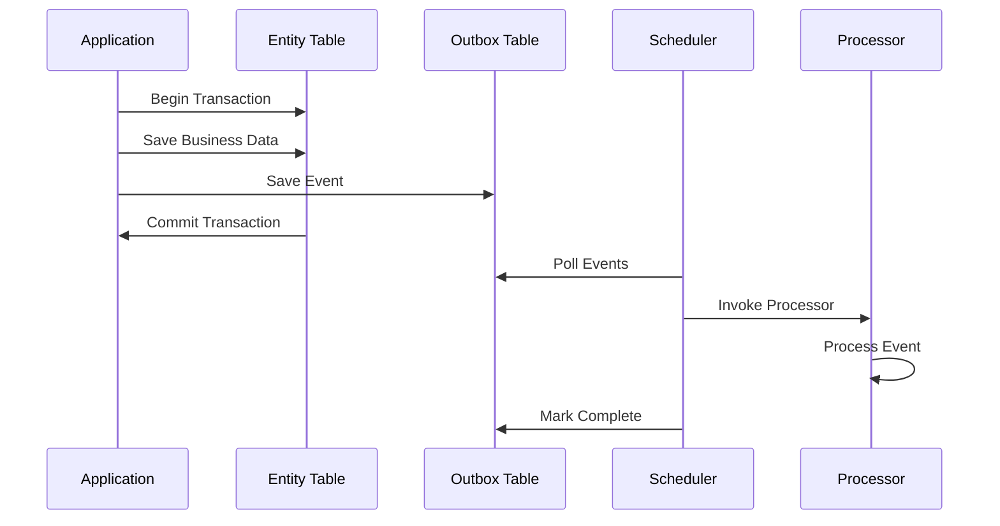
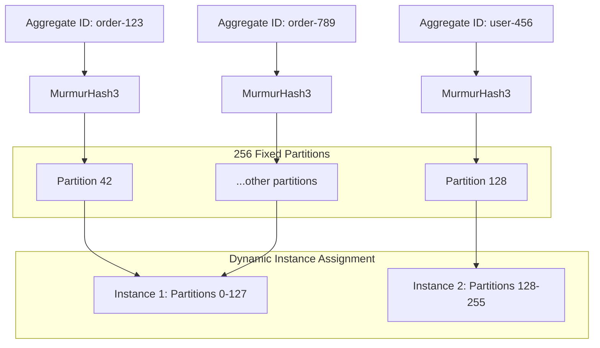

# Features

Namastack Outbox for Spring Boot provides a comprehensive set of features to implement the Outbox 
Pattern in distributed systems with reliability, scalability, and ease of use.

## :material-check-circle: Core Features

### :material-database-sync: Transactional Outbox Pattern

!!! success "Zero Message Loss"
    The library ensures that domain events are **never lost** by storing them in the same database transaction as your business data. This guarantees consistency between your domain state and published events.

#### Benefits

- **ACID Compliance**: Events are saved atomically with business data
- **Consistency Guarantee**: No partial updates or lost events
- **Failure Recovery**: System crashes don't result in data loss
- **Exactly-once semantics**: Events are processed reliably

#### How it Works



### :material-view-grid: Hash-based Partitioning

Instead of distributed locking, the library uses **hash-based partitioning** to enable horizontal scaling across multiple instances while maintaining strict event ordering per aggregate. This approach eliminates lock contention and provides better performance.

#### How Partitioning Works



#### Key Benefits

- **🎯 Consistent Hashing**: Each aggregate always maps to the same partition using MurmurHash3
- **⚡ No Lock Contention**: Eliminates distributed lock overhead and deadlock risks
- **📈 Horizontal Scaling**: Partitions automatically redistribute when instances join/leave
- **🔄 Load Balancing**: Even distribution of partitions across all active instances
- **🛡️ Ordering Guarantee**: Events within the same aggregate process in strict order
- **🚀 Better Performance**: No lock acquisition/renewal overhead

#### Partition Assignment

256 fixed partitions provide fine-grained load distribution. Partitions are automatically distributed among active instances. Each aggregate always maps to the same partition.

```kotlin
val partition = PartitionHasher.getPartitionForAggregate("order-123")
```

#### Instance Coordination

```yaml
outbox:
  instance:
    graceful-shutdown-timeout-seconds: 15     # Time to wait for graceful shutdown
    stale-instance-timeout-seconds: 30        # When to consider an instance dead
    heartbeat-interval-seconds: 5             # How often instances send heartbeats
    new-instance-detection-interval-seconds: 10  # How often to check for new instances
```

!!! example "Scaling Behavior"

    === "3 Instances with 256 Partitions"
        ```
        Instance 1: Partitions 0-84   (85 partitions)
        Instance 2: Partitions 85-169 (85 partitions) 
        Instance 3: Partitions 170-255 (86 partitions)
        ```

    === "Instance 2 Goes Down"
        ```
        Instance 1: Partitions 0-84, 170-211   (127 partitions)
        Instance 3: Partitions 85-169, 212-255 (129 partitions)
        ```
        
        **🔄 Automatic Rebalancing**: Partitions from failed instances are redistributed

    === "New Instance Joins"
        ```
        Instance 1: Partitions 0-63    (64 partitions)
        Instance 2: Partitions 64-127  (64 partitions)
        Instance 3: Partitions 128-191 (64 partitions)
        Instance 4: Partitions 192-255 (64 partitions)
        ```
        
        **⚖️ Load Balancing**: Partitions are redistributed evenly

### :material-sort-numeric-ascending: Event Ordering

!!! note "Guaranteed Processing Order"
    Events for the same aggregate are **always processed in creation order**, ensuring business logic consistency and preventing race conditions.

**Key Benefits:**

- :material-arrow-right: **Aggregate Consistency**: Events within an aggregate maintain order
- :material-arrow-right: **Business Logic Safety**: Dependent events process in correct sequence  
- :material-arrow-right: **Parallel Aggregates**: Different aggregates process independently
- :material-arrow-right: **Scalable Design**: No global ordering bottlenecks

Control how the scheduler handles failures within aggregates:

!!! example "Stop on First Failure"

    === "Enabled (Default)"
        ```yaml
        outbox:
          processing:
            stop-on-first-failure: true
        ```
        
        - When one event fails, processing stops for remaining events in that aggregate
        - Maintains strict event ordering within aggregates
        - Prevents cascading issues from dependent events
        - **Recommended**: When events within an aggregate have dependencies
    
    === "Disabled"
        ```yaml
        outbox:
          processing:
            stop-on-first-failure: false
        ```
        
        - Failed events don't block independent events in the same aggregate
        - Maximizes throughput for independent events
        - **Recommended**: When events within an aggregate are independent

**Behavior Comparison:**

| Configuration    | Event 1                  | Event 2                | Event 3                  | Result                         |
|------------------|--------------------------|------------------------|--------------------------|--------------------------------|
| `true` (default) | :material-check: Success | :material-close: Fails | :material-pause: Skipped | Event 2 retried, Event 3 waits |
| `false`          | :material-check: Success | :material-close: Fails | :material-check: Success | Event 2 retried independently  |

### :material-broadcast: OutboxEventMulticaster

Namastack Outbox provides a custom `OutboxEventMulticaster` that intercepts and stores all events annotated with `@OutboxEvent` in the outbox table. This multicaster integrates seamlessly with Spring's event system and ensures that events are reliably persisted and later processed, regardless of whether they are published via `@DomainEvents` or `ApplicationEventPublisher`.

**Key Features:**
- Intercepts all events annotated with `@OutboxEvent`
- Stores events transactionally in the outbox table
- Works with both `@DomainEvents` and direct `ApplicationEventPublisher` usage
- Optionally publishes events to other listeners in the same transaction (`publish-after-save: true`)
- Ensures that only events with the annotation are handled by the outbox
- Uses a pluggable serializer for event payloads (default: Jackson)

**How it works:**
- When an event is published, the multicaster checks for the `@OutboxEvent` annotation.
- If present, the event is serialized and stored in the outbox table.
- If `publish-after-save` is enabled, the event is also forwarded to other listeners.
- Serialization and deserialization is handled by the `OutboxEventSerializer` (default: Jackson, see below).

#### @OutboxEvent Annotation

The `@OutboxEvent` annotation marks a class as an outbox event. Only events with this annotation are intercepted and stored by the outbox multicaster. The annotation supports SpEL expressions for dynamic aggregateId extraction and allows you to specify a custom event type.

**Example:**
```kotlin
@OutboxEvent(
    aggregateId = "#root.id.toString()", // required
    eventType = "OrderCreatedEvent"      // optional
)
data class OrderCreatedEvent(
    val id: UUID,
    // ...other fields
)
```

- You can use SpEL to extract the aggregateId from any property of your event.
- If you omit `eventType`, the fully qualified class name is used by default.

#### Serialization: namastack-outbox-jackson & Custom Serializer

The `namastack-outbox-jackson` module provides a default implementation of `OutboxEventSerializer` using Jackson for JSON serialization. This module is included automatically with the starter and works out of the box for most use cases.

- Serializes and deserializes event payloads as JSON
- Supports all standard Jackson features (custom modules, mixins, etc.)
- No configuration required if you use the starter

**Custom Serialization:**
If you need a different serialization format (e.g. XML, Avro, Protobuf), you can provide your own implementation of `OutboxEventSerializer` as a Spring bean. The library will automatically use your custom serializer instead of the default.

**How to provide a custom serializer:**

1. Implement the `OutboxEventSerializer` interface.
2. Register your implementation as a Spring bean.
3. The outbox will use your serializer for all event payloads.

### :material-refresh: Retry Mechanisms

The library provides sophisticated retry strategies to handle transient failures gracefully.

=== "Fixed Delay"

    ```yaml
    outbox:
      retry:
        policy: "fixed"
        max-retries: 5
        fixed:
          delay: 5000  # 5 seconds between retries
    ```

    **Use Case**: Simple scenarios with consistent retry intervals

=== "Exponential Backoff"
    
    ```yaml
    outbox:
      retry:
        policy: "exponential"
        max-retries: 10
        exponential:
          initial-delay: 1000    # Start with 1 second
          max-delay: 300000      # Cap at 5 minutes
          multiplier: 2.0        # Double each time
    ```

    **Retry Schedule**: 1s → 2s → 4s → 8s → 16s → ... (up to max-delay)

=== "Jittered Retry"

    ```yaml
    outbox:
      retry:
        policy: "jittered"
        max-retries: 7
        jittered:
          base-policy: exponential
          jitter: 1000           # Add 0-1000ms random delay
        exponential:
          initial-delay: 2000
          max-delay: 60000
          multiplier: 2.0
    ```

    **Benefits**: Prevents thundering herd problems in high-traffic systems

#### :material-puzzle-outline: Custom Retry Policy Implementation

For advanced scenarios, you can implement your own retry policy by creating a custom implementation of the `OutboxRetryPolicy` interface. This allows you to define sophisticated retry logic tailored to your specific use cases.

**Quick Example:**

```kotlin
class CustomRetryPolicy : OutboxRetryPolicy {
    override fun shouldRetry(exception: Throwable): Boolean {
        // Don't retry validation errors
        return exception !is IllegalArgumentException
    }

    override fun nextDelay(retryCount: Int): Duration {
        // Exponential backoff: 1s → 2s → 4s → 8s (capped at 60s)
        val delay = 1000L * (1L shl retryCount)
        return Duration.ofMillis(minOf(delay, 60000L))
    }
}

@Configuration
class OutboxConfig {
    @Bean
    fun customRetryPolicy() = CustomRetryPolicy()
}
```

---

## :material-database: Database Support

### Supported Databases

- :material-elephant: **PostgreSQL** (Recommended)
- :material-dolphin: **MySQL**
- :seal: **MariaDB**
- :material-microsoft-azure: **SQL Server**
- :fontawesome-regular-circle: **Oracle**
- :material-database: **H2** (Development/Testing)

### Schema Management

Let the library create its schema automatically:

```yaml
outbox:
  schema-initialization:
    enabled: true
```

Or create the tables manually. You can look up the latest database schemas for all supported databases [here](https://github.com/namastack/namastack-outbox/tree/main/namastack-outbox-jpa/src/main/resources/schema).

---

## :material-chart-line: Monitoring & Observability

### :material-package-down: Including the Metrics Module

The `namastack-outbox-metrics` module provides automatic integration with Spring Boot Actuator and Micrometer. To enable monitoring and observability features, include the `namastack-outbox-metrics` module in your project:

=== "Gradle"
    ```kotlin
    dependencies {
        implementation("io.namastack:namastack-outbox-starter-jpa")
        implementation("io.namastack:namastack-outbox-metrics")
        
        // For Prometheus endpoint (optional)
        implementation("io.micrometer:micrometer-registry-prometheus")
    }
    ```

=== "Maven"
    ```xml
    <dependencies>
        <dependency>
            <groupId>io.namastack</groupId>
            <artifactId>namastack-outbox-starter-jpa</artifactId>
            <version>${namastack-outbox.version}</version>
        </dependency>
        <dependency>
            <groupId>io.namastack</groupId>
            <artifactId>namastack-outbox-metrics</artifactId>
            <version>${namastack-outbox.version}</version>
        </dependency>
        
        <!-- For Prometheus endpoint (optional) -->
        <dependency>
            <groupId>io.micrometer</groupId>
            <artifactId>micrometer-registry-prometheus</artifactId>
        </dependency>
    </dependencies>
    ```

### :material-monitor-dashboard: Built-in Metrics

=== "Available Metrics"
    | Metric | Description | Tags |
    |--------|-------------|------|
    | `outbox.records.count` | Number of outbox records | `status=new|failed|completed` |
    | `outbox.partitions.assigned.count` | Number of partitions assigned to this instance | - |
    | `outbox.partitions.pending.records.total` | Total pending records across assigned partitions | - |
    | `outbox.partitions.pending.records.max` | Maximum pending records in any assigned partition | - |
    | `outbox.partitions.pending.records.avg` | Average pending records per assigned partition | - |
    | `outbox.cluster.instances.total` | Total number of active instances in the cluster | - |
    | `outbox.cluster.partitions.total` | Total number of partitions (always 256) | - |
    | `outbox.cluster.partitions.avg_per_instance` | Average partitions per instance | - |
    
    **Endpoints:**
    
    - :material-api: `/actuator/metrics/outbox.records.count`
    - :material-api: `/actuator/metrics/outbox.partitions.assigned.count`
    - :material-api: `/actuator/metrics/outbox.cluster.instances.total`
    - :material-chart-box: `/actuator/prometheus` (if Prometheus enabled)

=== "Prometheus Format"
    ```prometheus
    # Record status metrics
    outbox_records_count{status="new"} 42
    outbox_records_count{status="failed"} 3  
    outbox_records_count{status="completed"} 1337
    
    # Partition metrics
    outbox_partitions_assigned_count 64
    outbox_partitions_pending_records_total 128
    outbox_partitions_pending_records_max 8
    outbox_partitions_pending_records_avg 2.0
    
    # Cluster metrics
    outbox_cluster_instances_total 4
    outbox_cluster_partitions_total 256
    outbox_cluster_partitions_avg_per_instance 64.0
    ```

=== "Query Examples"
    ```bash
    # Get current record metrics
    curl http://localhost:8080/actuator/metrics/outbox.records.count
    
    # Get partition distribution
    curl http://localhost:8080/actuator/metrics/outbox.partitions.assigned.count
    
    # Get cluster status
    curl http://localhost:8080/actuator/metrics/outbox.cluster.instances.total
    
    # Prometheus endpoint (all metrics)
    curl http://localhost:8080/actuator/prometheus | grep outbox
    ```

=== "Grafana Dashboard Ideas"
    ```
    📊 Load Distribution
    - Monitor outbox.partitions.pending.records.* across instances
    - Alert on uneven partition distribution
    
    🏥 Cluster Health  
    - Track outbox.cluster.instances.total for instance failures
    - Monitor partition reassignment frequency
    
    📈 Processing Backlog
    - Watch outbox.records.count{status="new"} for backlogs
    - Alert on growing pending record counts
    
    ❌ Failure Rate
    - Monitor outbox.records.count{status="failed"} for issues
    - Track retry patterns and failure trends
    ```

### :material-database-search: Status & Partition Monitoring

Monitor outbox status and partition distribution programmatically:

```kotlin
@Service
class OutboxMonitoringService(
    private val outboxRepository: OutboxRecordRepository,
    private val partitionMetricsProvider: OutboxPartitionMetricsProvider
) {
    // Record status monitoring
    fun getPendingEvents(): List<OutboxRecord> = 
        outboxRepository.findPendingRecords()
        
    fun getFailedEvents(): List<OutboxRecord> = 
        outboxRepository.findFailedRecords()
        
    fun getCompletedEvents(): List<OutboxRecord> = 
        outboxRepository.findCompletedRecords()
    
    fun getPartitionStats(): PartitionProcessingStats {
        return partitionMetricsProvider.getProcessingStats()
    }

    fun getClusterStats(): PartitionStats {
        return partitionMetricsProvider.getPartitionStats()
    }
    
    // Health check example
    fun getHealthStatus(): OutboxHealthStatus {
        val pendingCount = outboxRepository.countByStatus(OutboxRecordStatus.NEW)
        val failedCount = outboxRepository.countByStatus(OutboxRecordStatus.FAILED)
        val partitionStats = partitionMetricsProvider.getProcessingStats()
        
        return OutboxHealthStatus(
            pendingRecords = pendingCount,
            failedRecords = failedCount,
            assignedPartitions = partitionStats.assignedPartitions,
            totalPendingInPartitions = partitionStats.totalPendingRecords,
            isHealthy = failedCount < 100 && pendingCount < 1000
        )
    }
}

data class OutboxHealthStatus(
    val pendingRecords: Long,
    val failedRecords: Long,
    val assignedPartitions: Int,
    val totalPendingInPartitions: Long,
    val isHealthy: Boolean
)
```

## :material-lightning-bolt: Performance Features

### :material-rocket: High Throughput

!!! performance "Optimized for Scale"
    - **Batch Processing**: Multiple events processed efficiently
    - **Connection Pooling**: Database connections managed optimally  
    - **Minimal Overhead**: Lightweight processing with low latency
    - **Concurrent Aggregates**: Parallel processing across different aggregates

### :material-shield-check: Race Condition Safety

=== "Partition-based Isolation"
    - Events for the same aggregate always process on the same instance
    - No coordination needed between instances for the same aggregate
    - Hash-based partitioning ensures consistent aggregate assignment
    - Eliminates race conditions through architectural design

=== "Lock-Free Design"
    - No distributed locks or coordination overhead
    - Partition ownership provides natural isolation
    - Instance coordination only for partition assignment
    - Optimistic concurrency for instance management only

## :material-tune: Performance Tuning

This chapter explains how to optimize Namastack Outbox for your specific use case by adjusting configuration settings. The default values are well-balanced for most applications, but you can fine-tune them based on your workload characteristics.

### Polling & Batch Configuration

The polling mechanism controls how frequently the scheduler checks for new records and how many to process.

**Configuration:**

```yaml
outbox:
  poll-interval: 2000          # How often to check for records (milliseconds)
  batch-size: 10               # Maximum aggregates to process per poll cycle
```

**Impact on Performance:**

| Setting | Value | Pros | Cons | Best For |
|---------|-------|------|------|----------|
| `poll-interval` | **500ms** | Low latency, events processed quickly | Higher CPU/DB load, more queries | Real-time scenarios, critical events |
| `poll-interval` | **2000ms** (default) | Good balance | Slight latency | Most applications |
| `poll-interval` | **5000ms** | Low resource usage | Higher latency (5s delay) | High-volume systems, non-critical events |
| `batch-size` | **5** | Lower memory usage, faster commits | More polling cycles needed | Memory-constrained environments |
| `batch-size` | **10** (default) | Balanced throughput | Moderate resource usage | General purpose |
| `batch-size` | **50** | High throughput, fewer DB roundtrips | Longer processing cycles, higher memory | High-volume, low-latency capable systems |
| `batch-size` | **100+** | Maximum throughput optimization | Large memory footprint, long cycles | Massive scale, dedicated infrastructure |

**Tuning Guide:**

=== "Low Latency (< 1 second response time)"
    ```yaml
    outbox:
      poll-interval: 500        # Check every 500ms
      batch-size: 5             # Process 5 aggregates at a time
    ```
    
    **Characteristics:**
    - Events processed within milliseconds
    - Suitable for critical business operations
    - Higher database and CPU usage
    - Example: Payment processing, fraud detection

=== "Balanced (Default)"
    ```yaml
    outbox:
      poll-interval: 2000       # Check every 2 seconds
      batch-size: 10            # Process 10 aggregates at a time
    ```
    
    **Characteristics:**
    - Events processed within seconds
    - Suitable for most web applications
    - Moderate resource consumption
    - Example: E-commerce orders, user registrations

=== "High Throughput (No Latency Requirements)"
    ```yaml
    outbox:
      poll-interval: 5000       # Check every 5 seconds
      batch-size: 50            # Process 50 aggregates at a time
    ```
    
    **Characteristics:**
    - Events processed within seconds to minutes
    - Optimized for resource efficiency
    - Very low database load per cycle
    - Example: Bulk analytics, log aggregation, batch processing

### Parallel Processing Configuration

Control how many aggregates are processed in parallel within a single instance.

**Configuration:**

```yaml
outbox:
  processing:
    executor-core-pool-size: 4    # Base number of threads
    executor-max-pool-size: 8     # Maximum number of threads
```

**How Thread Pool Works:**

```
Incoming aggregates from batch query
        ↓
┌───────────────────────────────────┐
│  Thread Pool (core=4, max=8)      │
├───────────────────────────────────┤
│ [Worker 1] - Aggregate A          │
│ [Worker 2] - Aggregate B          │
│ [Worker 3] - Aggregate C          │
│ [Worker 4] - Aggregate D          │
│                                   │
│ [Queue] - Aggregate E, F, G       │
│           (waiting for worker)    │
└───────────────────────────────────┘
        ↓
    Processing
```

**Tuning Guide:**

=== "Single Core Machine"
    ```yaml
    outbox:
      processing:
        executor-core-pool-size: 1
        executor-max-pool-size: 2
    ```
    
    - Minimal thread overhead
    - Sequential processing
    - Low memory usage

=== "Quad-Core CPU (Recommended Default)"
    ```yaml
    outbox:
      processing:
        executor-core-pool-size: 4    # Match CPU cores
        executor-max-pool-size: 8     # 2x core pool size
    ```
    
    - Optimal CPU utilization
    - Good for I/O-bound processors
    - Balanced resource usage

=== "High CPU Count (16+ cores)"
    ```yaml
    outbox:
      processing:
        executor-core-pool-size: 12
        executor-max-pool-size: 24
    ```
    
    - Full CPU utilization
    - High concurrency
    - Requires larger batch sizes to feed workers

=== "I/O-Heavy Processors (REST calls, DB queries)"
    ```yaml
    outbox:
      processing:
        executor-core-pool-size: 8
        executor-max-pool-size: 16
    ```
    
    - Threads can wait for I/O without blocking
    - Higher concurrency needed
    - Can tolerate more threads than CPU cores

**Recommendations:**

```yaml
// For I/O-bound work (HTTP calls, external APIs):
executor-core-pool-size: CPU_CORES * 2
executor-max-pool-size: CPU_CORES * 4
```

```yaml
// For CPU-bound work (calculations, transformations):
executor-core-pool-size: CPU_CORES
executor-max-pool-size: CPU_CORES * 1.5
```

```java
// Get CPU cores in Java:
val cores = Runtime.getRuntime().availableProcessors();
```

### Completed Record Cleanup

Control whether records are deleted or marked as completed after successful processing.

**Configuration:**

```yaml
outbox:
  processing:
    delete-completed-records: false   # Default: keep records as audit trail
```

**Performance Impact:**

=== "delete-completed-records: false (Default)"
    ```
    ✅ Advantages:
    - Audit trail maintained for compliance
    - Can query completed records for verification
    - Useful for debugging
    
    ❌ Disadvantages:
    - Table grows indefinitely
    - Queries slower as table gets larger
    - More storage required
    ```

=== "delete-completed-records: true"
    ```
    ✅ Advantages:
    - Table stays lean and fast
    - Queries remain performant
    - Reduced storage consumption
    - Better for high-volume systems
    
    ❌ Disadvantages:
    - No audit trail after deletion
    - Can't verify if record was processed
    - Not suitable for compliance requirements
    ```

**When to Enable:**

```yaml
# Enable deletion if:
# - Processing millions of records
# - Audit trail not required
# - Table is experiencing performance degradation

outbox:
  processing:
    delete-completed-records: true
    
    # Combine with aggressive batch size for efficiency
    batch-size: 100
```

**Monitoring Completed Records:**

If `delete-completed-records: false`, monitor your record counts via the built-in metrics:

=== "Get All Record Counts"
    ```bash
    curl http://localhost:8080/actuator/metrics/outbox.records.count
    ```
    
    **Response:**
    ```json
    {
      "name": "outbox.records.count",
      "measurements": [
        {
          "statistic": "VALUE",
          "value": 1337,
          "tags": [
            {
              "tag": "status",
              "value": "completed"
            }
          ]
        },
        {
          "statistic": "VALUE",
          "value": 42,
          "tags": [
            {
              "tag": "status",
              "value": "new"
            }
          ]
        },
        {
          "statistic": "VALUE",
          "value": 3,
          "tags": [
            {
              "tag": "status",
              "value": "failed"
            }
          ]
        }
      ]
    }
    ```

=== "Get Completed Records Only"
    ```bash
    curl http://localhost:8080/actuator/metrics/outbox.records.count?tag=status:completed
    ```
    
    **Response:**
    ```json
    {
      "name": "outbox.records.count",
      "measurements": [
        {
          "statistic": "VALUE",
          "value": 1337
        }
      ]
    }
    ```

=== "Prometheus Format"
    If you have Prometheus enabled (`micrometer-registry-prometheus`), query:
    
    ```bash
    curl http://localhost:8080/actuator/prometheus | grep 'outbox_records_count'
    ```
    
    **Response:**
    ```prometheus
    # HELP outbox_records_count Number of outbox records
    # TYPE outbox_records_count gauge
    outbox_records_count{status="completed"} 1337.0
    outbox_records_count{status="failed"} 3.0
    outbox_records_count{status="new"} 42.0
    ```

**When to Take Action:**

- Completed records > **10 million**: Consider enabling `delete-completed-records: true` or archiving old records
- Growth rate > **1 million/day**: Monitor disk space and query performance
- Table size significantly impacting query performance: Set up automated archival

### :material-restart: Retry Configuration

Optimize retry behavior to balance responsiveness and resource usage.

**Configuration:**

```yaml
outbox:
  retry:
    max-retries: 3
    policy: "exponential"  # or "fixed", "jittered"
    exponential:
      initial-delay: 1000      # Start with 1 second
      max-delay: 300000        # Cap at 5 minutes
      multiplier: 2.0          # Double each retry
    fixed:
      delay: 5000              # Always wait 5 seconds
    jittered:
      base-policy: exponential
      jitter: 1000             # Add 0-1 second random delay
```

**Performance Tuning:**

=== "Aggressive Retry (Fast Recovery)"
    ```yaml
    outbox:
      retry:
        policy: "fixed"
        max-retries: 10
        fixed:
          delay: 500  # Retry every 500ms
    ```
    
    **Use When:**
    - Transient failures expected (network timeouts)
    - System has capacity for quick retries
    - Service is co-located (low latency)
    
    **Impact:**
    - Fast recovery from temporary failures
    - Higher load on external systems
    - More database queries

=== "Balanced Retry (Default)"
    ```yaml
    outbox:
      retry:
        policy: "exponential"
        max-retries: 3
        exponential:
          initial-delay: 2000
          max-delay: 60000
          multiplier: 2.0
    ```
    
    **Use When:**
    - Normal failures (service restarts, brief outages)
    - Want reasonable recovery time
    - Standard application
    
    **Retry Schedule:**
    - Attempt 1: Immediate
    - Attempt 2: 2 seconds
    - Attempt 3: 4 seconds
    - Attempt 4: 8 seconds (then cap at max-delay)

=== "Conservative Retry (Avoid Thundering Herd)"
    ```yaml
    outbox:
      retry:
        policy: "jittered"
        max-retries: 5
        exponential:
          initial-delay: 5000
          max-delay: 300000
          multiplier: 2.0
        jittered:
          jitter: 5000  # Add 0-5 second random delay
    ```
    
    **Use When:**
    - Protecting downstream systems
    - Multiple instances (high concurrency)
    - Can tolerate longer retry times
    
    **Impact:**
    - Prevents coordinated retry storms
    - Reduces load on failing services
    - Events processed within 5-30 minutes

### Instance Coordination Fine-tuning

Optimize cluster coordination overhead.

**Configuration:**

```yaml
outbox:
  instance:
    heartbeat-interval-seconds: 5              # How often to send heartbeat
    stale-instance-timeout-seconds: 30         # When to consider dead
    new-instance-detection-interval-seconds: 10  # Check for new instances
    graceful-shutdown-timeout-seconds: 15      # Wait for graceful shutdown
```

**Impact Analysis:**

| Setting | Value | Effects |
|---------|-------|---------|
| `heartbeat-interval-seconds` | Low (1-2s) | More frequent DB updates, faster failure detection, higher overhead |
| `heartbeat-interval-seconds` | Default (5s) | Good balance |
| `heartbeat-interval-seconds` | High (10-30s) | Minimal DB overhead, slower failure detection |
| `stale-instance-timeout-seconds` | Low (10s) | Fast rebalancing on failure, may trigger false positives |
| `stale-instance-timeout-seconds` | Default (30s) | 6x heartbeat interval, good tolerance |
| `stale-instance-timeout-seconds` | High (60s+) | Tolerates network glitches, slow rebalancing |

**Tuning Guide:**

=== "Stable Datacenter (Low Latency)"
    ```yaml
    outbox:
      instance:
        heartbeat-interval-seconds: 3
        stale-instance-timeout-seconds: 15
        new-instance-detection-interval-seconds: 5
        graceful-shutdown-timeout-seconds: 10
    ```
    
    - Fast failure detection
    - Quick rebalancing
    - Works in reliable networks

=== "Standard Cloud Environment (Default)"
    ```yaml
    outbox:
      instance:
        heartbeat-interval-seconds: 5
        stale-instance-timeout-seconds: 30
        new-instance-detection-interval-seconds: 10
        graceful-shutdown-timeout-seconds: 15
    ```
    
    - Balanced overhead
    - Tolerates minor network jitter
    - Reasonable rebalancing time

=== "Unreliable Network (Edge, WAN)"
    ```yaml
    outbox:
      instance:
        heartbeat-interval-seconds: 10
        stale-instance-timeout-seconds: 60
        new-instance-detection-interval-seconds: 30
        graceful-shutdown-timeout-seconds: 30
    ```
    
    - Minimal DB overhead
    - Tolerates network latency
    - Slower failure detection acceptable

### :material-stop: Stop on Failure Optimization

Control how failures impact processing within an aggregate.

**Configuration:**

```yaml
outbox:
  processing:
    stop-on-first-failure: true  # Stop processing on error
```

**Performance Implications:**

=== "stop-on-first-failure: true (Default)"
    ```yaml
    outbox:
      processing:
        stop-on-first-failure: true
    ```
    
    **Behavior:**
    - Event 1: ✅ Success
    - Event 2: ❌ Fails → Processing stops
    - Event 3: ⏸️ Waits (blocked)
    
    **Use When:**
    - Events within aggregate are dependent
    - Order matters critically
    - Cascading failures possible
    
    **Performance Impact:**
    - May block unrelated events
    - Safer (prevents data corruption)
    - Simpler error handling

=== "stop-on-first-failure: false"
    ```yaml
    outbox:
      processing:
        stop-on-first-failure: false
    ```
    
    **Behavior:**
    - Event 1: ✅ Success
    - Event 2: ❌ Fails → Continues
    - Event 3: ✅ Success (independent processing)
    
    **Use When:**
    - Events within aggregate are independent
    - Want maximum throughput
    - Can handle out-of-order completion
    
    **Performance Impact:**
    - Higher throughput
    - More parallel processing
    - May complete unrelated events first

---

### Performance Optimization Checklist

Use this checklist to optimize Namastack Outbox for your specific workload:

=== "For Latency-Critical Systems"
    - [ ] Set `poll-interval` to **500-1000ms**
    - [ ] Set `batch-size` to **5-10**
    - [ ] Set `executor-core-pool-size` to **CPU_CORES**
    - [ ] Use **exponential backoff** retry (fast recovery)
    - [ ] Set `heartbeat-interval-seconds` to **3-5**
    - [ ] Monitor P99 latency in `/actuator/metrics`

=== "For Throughput-Optimized Systems"
    - [ ] Set `poll-interval` to **5000ms** or higher
    - [ ] Set `batch-size` to **50-100+**
    - [ ] Set `executor-core-pool-size` to **CPU_CORES * 2**
    - [ ] Enable `delete-completed-records: true`
    - [ ] Use **jittered exponential backoff**
    - [ ] Monitor `outbox.partitions.pending.records.total`

=== "For Resource-Constrained Environments"
    - [ ] Set `poll-interval` to **5000-10000ms**
    - [ ] Set `batch-size` to **5**
    - [ ] Set `executor-core-pool-size` to **1-2**
    - [ ] Enable `delete-completed-records: true`
    - [ ] Use **fixed delay** retry (predictable)
    - [ ] Monitor thread pool utilization

=== "For High-Volume Systems (Millions/day)"
    - [ ] Set `poll-interval` to **1000-2000ms**
    - [ ] Set `batch-size` to **100+**
    - [ ] Set `executor-core-pool-size` to **CPU_CORES * 2-4**
    - [ ] Enable `delete-completed-records: true`
    - [ ] Use **jittered exponential backoff**
    - [ ] Add database **read replicas** for monitoring
    - [ ] Monitor partition distribution evenness

---

## :material-security: Reliability Guarantees

### What Namastack Outbox for Spring Boot Guarantees
    
- :material-check-all: **At-least-once delivery**: Events will be processed at least once
- :material-sort-ascending: **Ordering per aggregate**: Events for the same aggregate are processed in order
- :material-backup-restore: **Failure recovery**: System failures don't result in lost events
- :material-scale-balance: **Horizontal scalability**: Multiple instances process different partitions concurrently
- :material-shield-lock: **Consistency**: Database transactions ensure data integrity
- :material-clock-check: **Eventual consistency**: Failed events are automatically retried
- :material-autorenew: **Automatic rebalancing**: Partitions redistribute when instances join/leave
- :material-chart-line: **Linear scaling**: Performance scales with instance count

### What Namastack Outbox for Spring Boot Does NOT Guarantee
    
- :material-close: **Exactly-once delivery**: Events may be processed multiple times (your handlers should be idempotent)
- :material-close: **Global ordering**: No ordering guarantee across different aggregates
- :material-close: **Real-time processing**: Events are processed asynchronously with configurable delays

---

!!! tip "Next Steps"
    Ready to get started? Check out the [Quick Start Guide](quickstart.md) to integrate Namastack Outbox for Spring Boot into your application.
