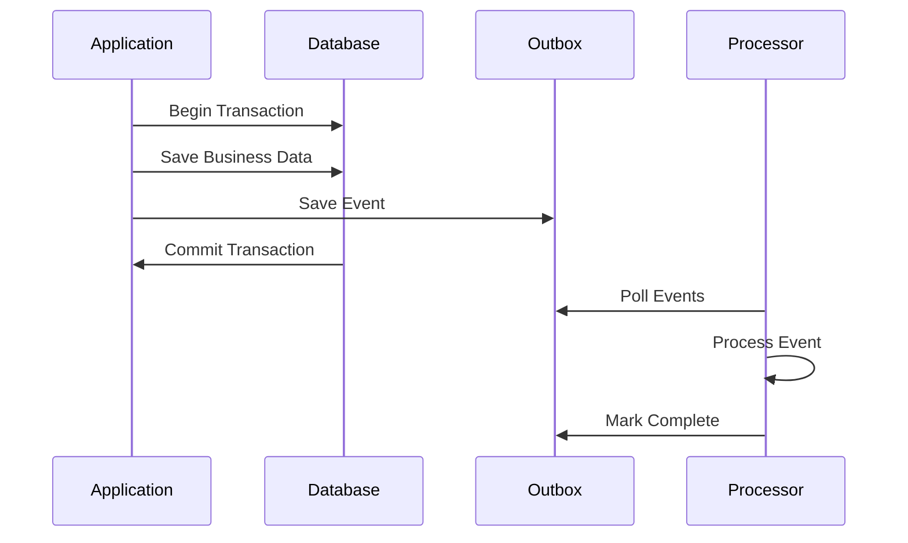

# Features

Namastack Outbox for Spring Boot provides a comprehensive set of features to implement the Outbox 
Pattern in distributed systems with reliability, scalability, and ease of use.

## :material-check-circle: Core Features

### :material-database-sync: Transactional Outbox Pattern

!!! success "Zero Message Loss"
    The library ensures that domain events are **never lost** by storing them in the same database transaction as your business data. This guarantees consistency between your domain state and published events.

#### Benefits

- **ACID Compliance**: Events are saved atomically with business data
- **Consistency Guarantee**: No partial updates or lost events
- **Failure Recovery**: System crashes don't result in data loss
- **Exactly-once semantics**: Events are processed reliably

#### How it Works



### :material-view-grid: Hash-based Partitioning

!!! success "Scalable Partition-based Coordination"
    Instead of distributed locking, the library uses **hash-based partitioning** to enable horizontal scaling across multiple instances while maintaining strict event ordering per aggregate. This approach eliminates lock contention and provides better performance.

=== "How Partitioning Works"
    ```mermaid
    graph TB
        A[Aggregate ID: order-123] --> H[MurmurHash3]
        H --> P[Partition 42]
        P --> I1[Instance 1]
        
        B[Aggregate ID: user-456] --> H2[MurmurHash3]
        H2 --> P2[Partition 128]
        P2 --> I2[Instance 2]
        
        C[Aggregate ID: order-789] --> H3[MurmurHash3]
        H3 --> P3[Partition 42]
        P3 --> I1
        
        subgraph "256 Fixed Partitions"
            P[Partition 42]
            P2[Partition 128]
            P3["...other partitions"]
        end
        
        subgraph "Dynamic Instance Assignment"
            I1[Instance 1: Partitions 0-127]
            I2[Instance 2: Partitions 128-255]
        end
    ```

=== "Key Benefits"
    - **🎯 Consistent Hashing**: Each aggregate always maps to the same partition using MurmurHash3
    - **⚡ No Lock Contention**: Eliminates distributed lock overhead and deadlock risks
    - **📈 Horizontal Scaling**: Partitions automatically redistribute when instances join/leave
    - **🔄 Load Balancing**: Even distribution of partitions across all active instances
    - **🛡️ Ordering Guarantee**: Events within the same aggregate process in strict order
    - **🚀 Better Performance**: No lock acquisition/renewal overhead

=== "Partition Assignment"
    ```kotlin
    // Each aggregate always maps to the same partition
    val partition = PartitionHasher.getPartitionForAggregate("order-123")
    // partition will always be the same value for "order-123"
    
    // 256 fixed partitions provide fine-grained load distribution
    // Partitions are automatically distributed among active instances
    ```

=== "Instance Coordination"
    ```yaml
    outbox:
      instance:
        graceful-shutdown-timeout-seconds: 15     # Time to wait for graceful shutdown
        stale-instance-timeout-seconds: 30        # When to consider an instance dead
        heartbeat-interval-seconds: 5             # How often instances send heartbeats
        new-instance-detection-interval-seconds: 10  # How often to check for new instances
    ```

!!! example "Scaling Behavior"

    === "3 Instances with 256 Partitions"
        ```
        Instance 1: Partitions 0-84   (85 partitions)
        Instance 2: Partitions 85-169 (85 partitions) 
        Instance 3: Partitions 170-255 (86 partitions)
        ```

    === "Instance 2 Goes Down"
        ```
        Instance 1: Partitions 0-84, 170-211   (127 partitions)
        Instance 3: Partitions 85-169, 212-255 (129 partitions)
        ```
        
        **🔄 Automatic Rebalancing**: Partitions from failed instances are redistributed

    === "New Instance Joins"
        ```
        Instance 1: Partitions 0-63    (64 partitions)
        Instance 2: Partitions 64-127  (64 partitions)
        Instance 3: Partitions 128-191 (64 partitions)
        Instance 4: Partitions 192-255 (64 partitions)
        ```
        
        **⚖️ Load Balancing**: Partitions are redistributed evenly

!!! info "Migration from Distributed Locking (v0.1.0 → v0.2.0)"
    If you're upgrading from version 0.1.0, the distributed locking approach has been **completely replaced** with hash-based partitioning. This change provides:
    
    - **Better Performance**: No lock acquisition overhead
    - **Improved Scalability**: Linear scaling with instance count
    - **Simplified Operations**: No lock management or deadlock handling
    - **Enhanced Reliability**: No single point of failure from lock storage
    
    See the [Migration Guide](https://github.com/namastack/namastack-outbox?tab=readme-ov-file#migration-from-010-to-020) for upgrade instructions.

### :material-sort-numeric-ascending: Event Ordering

!!! note "Guaranteed Processing Order"
    Events for the same aggregate are **always processed in creation order**, ensuring business logic consistency and preventing race conditions.

**Key Benefits:**

- :material-arrow-right: **Aggregate Consistency**: Events within an aggregate maintain order
- :material-arrow-right: **Business Logic Safety**: Dependent events process in correct sequence  
- :material-arrow-right: **Parallel Aggregates**: Different aggregates process independently
- :material-arrow-right: **Scalable Design**: No global ordering bottlenecks

Control how the scheduler handles failures within aggregates:

!!! example "Stop on First Failure"

    === "Enabled (Default)"
        ```yaml
        outbox:
          processing:
            stop-on-first-failure: true
        ```
        
        - When one event fails, processing stops for remaining events in that aggregate
        - Maintains strict event ordering within aggregates
        - Prevents cascading issues from dependent events
        - **Recommended**: When events within an aggregate have dependencies
    
    === "Disabled"
        ```yaml
        outbox:
          processing:
            stop-on-first-failure: false
        ```
        
        - Failed events don't block independent events in the same aggregate
        - Maximizes throughput for independent events
        - **Recommended**: When events within an aggregate are independent

**Behavior Comparison:**

| Configuration    | Event 1                  | Event 2                | Event 3                  | Result                         |
|------------------|--------------------------|------------------------|--------------------------|--------------------------------|
| `true` (default) | :material-check: Success | :material-close: Fails | :material-pause: Skipped | Event 2 retried, Event 3 waits |
| `false`          | :material-check: Success | :material-close: Fails | :material-check: Success | Event 2 retried independently  |

## :material-cog: Advanced Configuration

### :material-refresh: Retry Mechanisms

The library provides sophisticated retry strategies to handle transient failures gracefully.

=== "Fixed Delay"
    ```yaml
    outbox:
      retry:
        policy: "fixed"
        max-retries: 5
        fixed:
          delay: 5000  # 5 seconds between retries
    ```
    
    **Use Case**: Simple scenarios with consistent retry intervals

=== "Exponential Backoff" 
    ```yaml
    outbox:
      retry:
        policy: "exponential"
        max-retries: 10
        exponential:
          initial-delay: 1000    # Start with 1 second
          max-delay: 300000      # Cap at 5 minutes
          multiplier: 2.0        # Double each time
    ```
    
    **Retry Schedule**: 1s → 2s → 4s → 8s → 16s → ... (up to max-delay)

=== "Jittered Retry"
    ```yaml
    outbox:
      retry:
        policy: "jittered"
        max-retries: 7
        jittered:
          base-policy: exponential
          jitter: 1000           # Add 0-1000ms random delay
        exponential:
          initial-delay: 2000
          max-delay: 60000
          multiplier: 2.0
    ```
    
    **Benefits**: Prevents thundering herd problems in high-traffic systems

## :material-chart-line: Monitoring & Observability

### :material-package-down: Including the Metrics Module

!!! info "Add Dependency"
    To enable monitoring and observability features, include the `namastack-outbox-metrics` module in your project:

=== "Gradle"
    ```kotlin
    dependencies {
        implementation("io.namastack:namastack-outbox-starter-jpa")
        implementation("io.namastack:namastack-outbox-metrics")
        
        // For Prometheus endpoint (optional)
        implementation("io.micrometer:micrometer-registry-prometheus")
    }
    ```

=== "Maven"
    ```xml
    <dependencies>
        <dependency>
            <groupId>io.namastack</groupId>
            <artifactId>namastack-outbox-starter-jpa</artifactId>
            <version>${namastack-outbox.version}</version>
        </dependency>
        <dependency>
            <groupId>io.namastack</groupId>
            <artifactId>namastack-outbox-metrics</artifactId>
            <version>${namastack-outbox.version}</version>
        </dependency>
        
        <!-- For Prometheus endpoint (optional) -->
        <dependency>
            <groupId>io.micrometer</groupId>
            <artifactId>micrometer-registry-prometheus</artifactId>
        </dependency>
    </dependencies>
    ```

### :material-monitor-dashboard: Built-in Metrics

!!! tip "Micrometer Integration"
    The `namastack-outbox-metrics` module provides automatic integration with Spring Boot Actuator and Micrometer.

=== "Available Metrics"
    | Metric | Description | Tags |
    |--------|-------------|------|
    | `outbox.records.count` | Number of outbox records | `status=new\|failed\|completed` |
    | `outbox.partitions.assigned.count` | Number of partitions assigned to this instance | - |
    | `outbox.partitions.pending.records.total` | Total pending records across assigned partitions | - |
    | `outbox.partitions.pending.records.max` | Maximum pending records in any assigned partition | - |
    | `outbox.partitions.pending.records.avg` | Average pending records per assigned partition | - |
    | `outbox.cluster.instances.total` | Total number of active instances in the cluster | - |
    | `outbox.cluster.partitions.total` | Total number of partitions (always 256) | - |
    | `outbox.cluster.partitions.avg_per_instance` | Average partitions per instance | - |
    
    **Endpoints:**
    
    - :material-api: `/actuator/metrics/outbox.records.count`
    - :material-api: `/actuator/metrics/outbox.partitions.assigned.count`
    - :material-api: `/actuator/metrics/outbox.cluster.instances.total`
    - :material-chart-box: `/actuator/prometheus` (if Prometheus enabled)

=== "Prometheus Format"
    ```prometheus
    # Record status metrics
    outbox_records_count{status="new"} 42
    outbox_records_count{status="failed"} 3  
    outbox_records_count{status="completed"} 1337
    
    # Partition metrics
    outbox_partitions_assigned_count 64
    outbox_partitions_pending_records_total 128
    outbox_partitions_pending_records_max 8
    outbox_partitions_pending_records_avg 2.0
    
    # Cluster metrics
    outbox_cluster_instances_total 4
    outbox_cluster_partitions_total 256
    outbox_cluster_partitions_avg_per_instance 64.0
    ```

=== "Query Examples"
    ```bash
    # Get current record metrics
    curl http://localhost:8080/actuator/metrics/outbox.records.count
    
    # Get partition distribution
    curl http://localhost:8080/actuator/metrics/outbox.partitions.assigned.count
    
    # Get cluster status
    curl http://localhost:8080/actuator/metrics/outbox.cluster.instances.total
    
    # Prometheus endpoint (all metrics)
    curl http://localhost:8080/actuator/prometheus | grep outbox
    ```

=== "Grafana Dashboard Ideas"
    ```
    📊 Load Distribution
    - Monitor outbox.partitions.pending.records.* across instances
    - Alert on uneven partition distribution
    
    🏥 Cluster Health  
    - Track outbox.cluster.instances.total for instance failures
    - Monitor partition reassignment frequency
    
    📈 Processing Backlog
    - Watch outbox.records.count{status="new"} for backlogs
    - Alert on growing pending record counts
    
    ❌ Failure Rate
    - Monitor outbox.records.count{status="failed"} for issues
    - Track retry patterns and failure trends
    ```

### :material-database-search: Status & Partition Monitoring

Monitor outbox status and partition distribution programmatically:

```kotlin
@Service
class OutboxMonitoringService(
    private val outboxRepository: OutboxRecordRepository,
    private val partitionMetricsProvider: OutboxPartitionMetricsProvider
) {
    // Record status monitoring
    fun getPendingEvents(): List<OutboxRecord> = 
        outboxRepository.findPendingRecords()
        
    fun getFailedEvents(): List<OutboxRecord> = 
        outboxRepository.findFailedRecords()
        
    fun getCompletedEvents(): List<OutboxRecord> = 
        outboxRepository.findCompletedRecords()
    
    // Partition monitoring (new in v0.2.0)
    fun getPartitionStats(): PartitionProcessingStats {
        return partitionMetricsProvider.getProcessingStats()
    }

    fun getClusterStats(): PartitionStats {
        return partitionMetricsProvider.getPartitionStats()
    }
    
    // Health check example
    fun getHealthStatus(): OutboxHealthStatus {
        val pendingCount = outboxRepository.countByStatus(OutboxRecordStatus.NEW)
        val failedCount = outboxRepository.countByStatus(OutboxRecordStatus.FAILED)
        val partitionStats = partitionMetricsProvider.getProcessingStats()
        
        return OutboxHealthStatus(
            pendingRecords = pendingCount,
            failedRecords = failedCount,
            assignedPartitions = partitionStats.assignedPartitions,
            totalPendingInPartitions = partitionStats.totalPendingRecords,
            isHealthy = failedCount < 100 && pendingCount < 1000
        )
    }
}

data class OutboxHealthStatus(
    val pendingRecords: Long,
    val failedRecords: Long,
    val assignedPartitions: Int,
    val totalPendingInPartitions: Long,
    val isHealthy: Boolean
)
```

## :material-lightning-bolt: Performance Features

### :material-rocket: High Throughput

!!! performance "Optimized for Scale"
    - **Batch Processing**: Multiple events processed efficiently
    - **Connection Pooling**: Database connections managed optimally  
    - **Minimal Overhead**: Lightweight processing with low latency
    - **Concurrent Aggregates**: Parallel processing across different aggregates

### :material-shield-check: Race Condition Safety

=== "Partition-based Isolation"
    - Events for the same aggregate always process on the same instance
    - No coordination needed between instances for the same aggregate
    - Hash-based partitioning ensures consistent aggregate assignment
    - Eliminates race conditions through architectural design

=== "Lock-Free Design"
    - No distributed locks or coordination overhead
    - Partition ownership provides natural isolation
    - Instance coordination only for partition assignment
    - Optimistic concurrency for instance management only

## :material-code-braces: Developer Experience

### :material-puzzle: Easy Integration

!!! success "Minimal Setup Required"
    
    1. **Add Dependency**: Single JAR includes everything needed
    2. **Enable Annotation**: `@EnableOutbox` activates all features  
    3. **Configure Database**: Automatic schema creation available
    4. **Implement Processor**: Simple interface for event handling

=== "Builder Pattern"
    ```kotlin
    val outboxRecord = OutboxRecord.Builder()
        .aggregateId(order.id.toString())
        .eventType("OrderCreated")
        .payload(objectMapper.writeValueAsString(event))
        .build(clock)
    ```

=== "Restore Pattern"
    ```kotlin
    val outboxRecord = OutboxRecord.restore(
        id = UUID.randomUUID().toString(),
        aggregateId = order.id.toString(),
        eventType = "OrderCreated",
        payload = objectMapper.writeValueAsString(event),
        createdAt = OffsetDateTime.now(clock),
        status = OutboxRecordStatus.NEW,
        completedAt = null,
        retryCount = 0,
        nextRetryAt = OffsetDateTime.now(clock)
    )
    ```

### :material-test-tube: Testing Support

- **Unit Tests**: All components with high coverage
- **Integration Tests**: Real database and locking scenarios  
- **Concurrency Tests**: Race condition validation
- **Performance Tests**: High-throughput scenarios

```bash
./gradlew test
```

## :material-database: Database Support

!!! info "Broad Compatibility"
    Works with any JPA-supported database:

=== "Supported Databases"
    - :material-elephant: **PostgreSQL** (Recommended)
    - :material-dolphin: **MySQL** 
    - :material-database: **H2** (Development/Testing)
    - :material-microsoft-azure: **SQL Server**
    - :material-oracle: **Oracle**
    - And any other JPA-compatible database

=== "Schema Management"
    ```yaml
    # Automatic schema creation
    outbox:
      schema-initialization:
        enabled: true
    ```
    
    Or use manual SQL scripts for production deployments.

## :material-security: Reliability Guarantees

!!! check "What Namastack Outbox for Spring Boot Guarantees"
    
    - :material-check-all: **At-least-once delivery**: Events will be processed at least once
    - :material-sort-ascending: **Ordering per aggregate**: Events for the same aggregate are processed in order
    - :material-backup-restore: **Failure recovery**: System failures don't result in lost events
    - :material-scale-balance: **Horizontal scalability**: Multiple instances process different partitions concurrently
    - :material-shield-lock: **Consistency**: Database transactions ensure data integrity
    - :material-clock-check: **Eventual consistency**: Failed events are automatically retried
    - :material-autorenew: **Automatic rebalancing**: Partitions redistribute when instances join/leave
    - :material-chart-line: **Linear scaling**: Performance scales with instance count

!!! warning "What Namastack Outbox for Spring Boot Does NOT Guarantee"
    
    - :material-close: **Exactly-once delivery**: Events may be processed multiple times (your handlers should be idempotent)
    - :material-close: **Global ordering**: No ordering guarantee across different aggregates
    - :material-close: **Real-time processing**: Events are processed asynchronously with configurable delays

---

!!! tip "Next Steps"
    Ready to get started? Check out the [Quick Start Guide](quickstart.md) to integrate Namastack Outbox for Spring Boot into your application.
