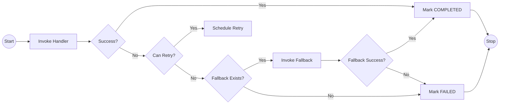
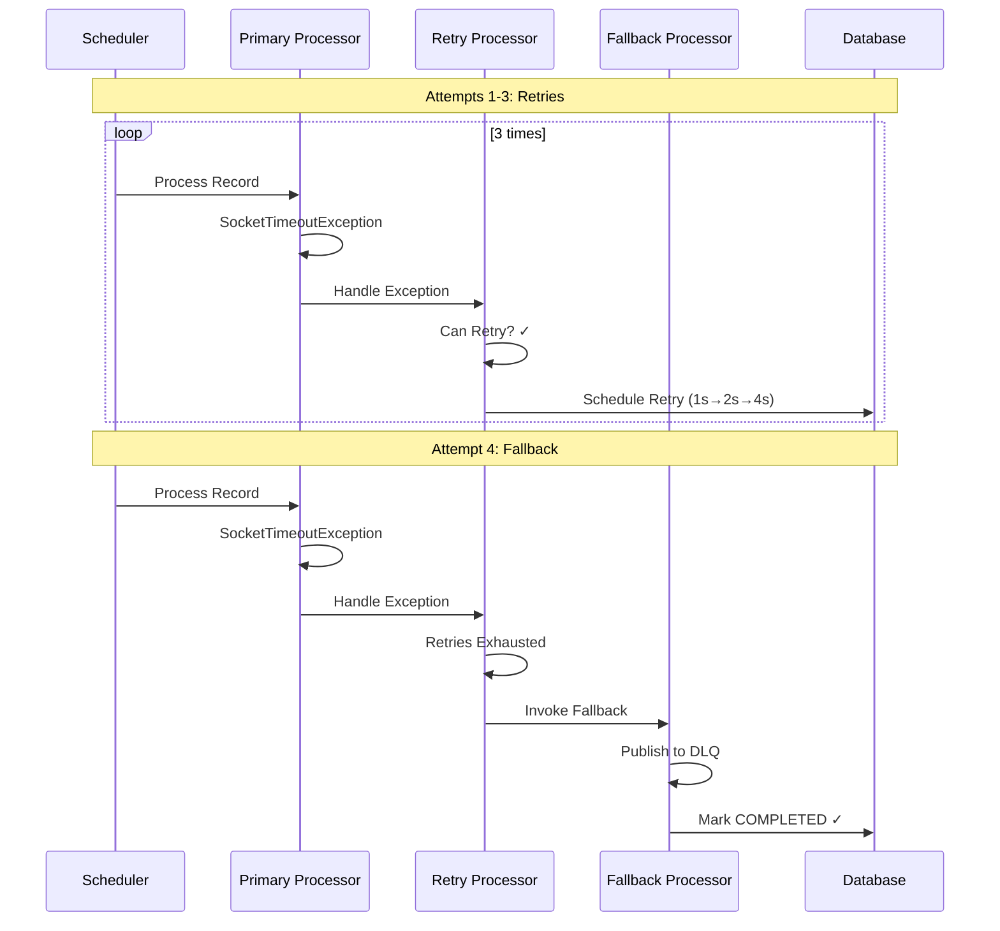
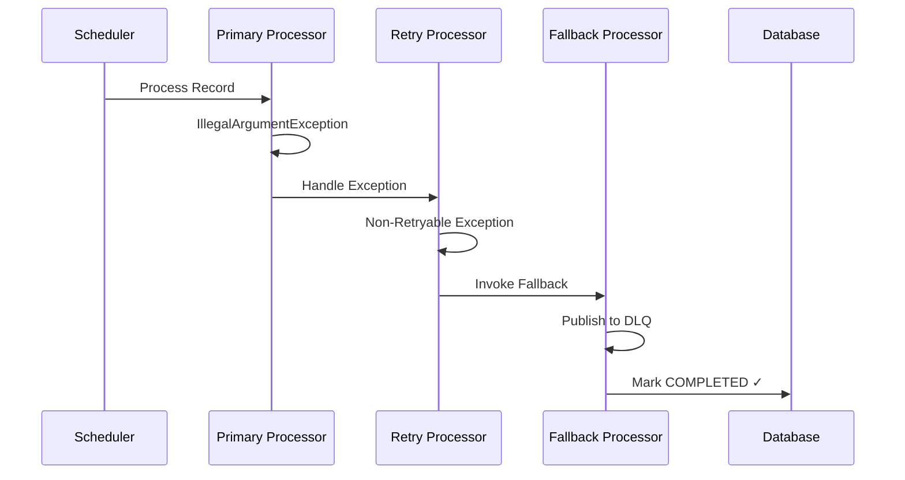
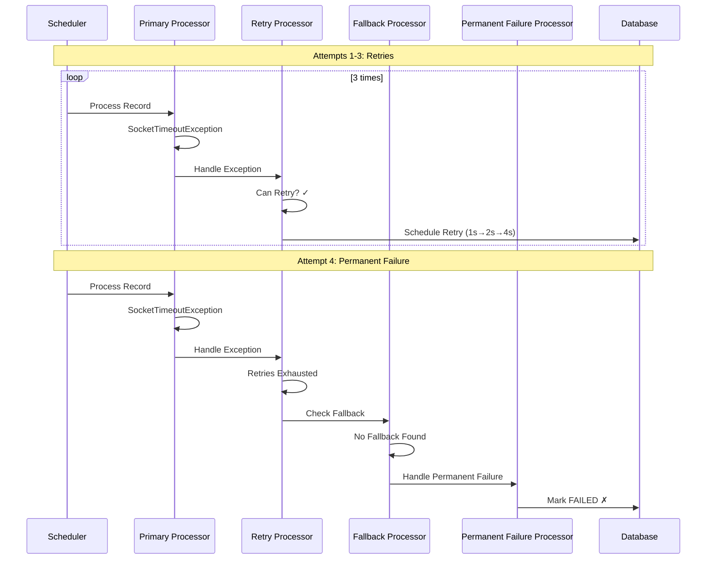

# Processing Chain

!!! info "Internal Processing Pipeline"
    The library uses a **Chain of Responsibility** pattern to process outbox records through multiple stages. Each processor in the chain handles a specific concern and can delegate to the next processor when needed.

## Chain Architecture

The processing chain consists of four processors, executed in this exact order:

**Processing Flow:**

1. **Primary Handler Processor** - Invokes the registered handler for the payload type. On success, marks record as `COMPLETED`. On exception, passes to Retry Processor.

2. **Retry Processor** - Evaluates if the exception is retryable and if retry limit is not exceeded. Schedules next retry with calculated delay or passes to Fallback Processor.

3. **Fallback Processor** - Invokes registered fallback handler if available. On success, marks record as `COMPLETED`. On failure or if no fallback exists, passes to Permanent Failure Processor.

4. **Permanent Failure Processor** - Marks the record as permanently `FAILED`. Final state - no further processing.

---

## Processing Flow Examples

### Scenario 1: Retries Exhausted with Successful Fallback

Order processing with 3 max retries and fallback handler:

### Scenario 2: Non-Retryable Exception

Order processing with non-retryable exception:

### Scenario 3: No Fallback Handler

Order processing without fallback handler:

