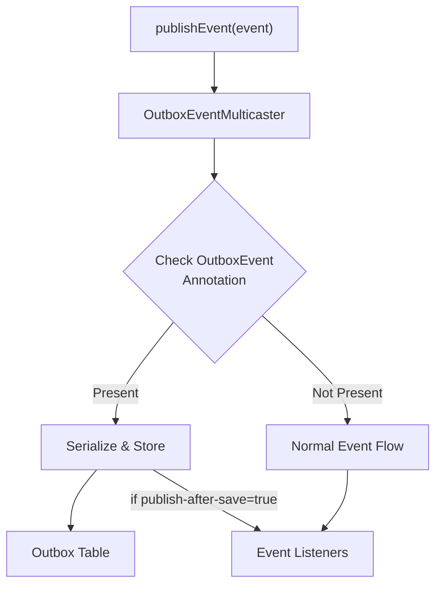

# Record Scheduling

## Outbox Service API

Schedule records for processing via the `Outbox` service:

=== "Kotlin"

    ```kotlin
    @Service
    class OrderService(
        private val outbox: Outbox,
        private val orderRepository: OrderRepository
    ) {
        @Transactional
        fun createOrder(command: CreateOrderCommand) {
            val order = Order.create(command)
            orderRepository.save(order)
            
            // Schedule record with explicit key
            outbox.schedule(
                payload = OrderCreatedRecord(order.id, order.customerId),
                key = "order-${order.id}"  // Groups records for ordered processing
            )
        }
        
        @Transactional
        fun updateOrder(orderId: String) {
            // Schedule record with auto-generated UUID key
            outbox.schedule(payload = OrderUpdatedRecord(orderId))
        }
    }
    ```

=== "Java"

    ```java
    @Service
    public class OrderService {
        private final Outbox outbox;
        private final OrderRepository orderRepository;

        public OrderService(Outbox outbox, OrderRepository orderRepository) {
            this.outbox = outbox;
            this.orderRepository = orderRepository;
        }

        @Transactional
        public void createOrder(CreateOrderCommand command) {
            Order order = Order.create(command);
            orderRepository.save(order);
            
            // Schedule record with explicit key
            outbox.schedule(
                new OrderCreatedRecord(order.getId(), order.getCustomerId()),
                "order-" + order.getId()  // Groups records for ordered processing
            );
        }
        
        @Transactional
        public void updateOrder(String orderId) {
            // Schedule record with auto-generated UUID key
            outbox.schedule(new OrderUpdatedRecord(orderId));
        }
    }
    ```

### Record Lifecycle

Records go through the following states:

- **NEW**: Freshly scheduled, waiting for processing
- **COMPLETED**: Successfully processed by all handlers
- **FAILED**: Exhausted all retries, requires manual intervention

---

## OutboxEventMulticaster

The `OutboxEventMulticaster` provides seamless integration with Spring's event system. It automatically intercepts and persists events annotated with `@OutboxEvent` directly to the outbox table, allowing you to use Spring's native `ApplicationEventPublisher` while getting outbox benefits.

### How It Works



### @OutboxEvent Annotation

Mark your events with `@OutboxEvent` to enable automatic outbox persistence:

=== "Kotlin"

    ```kotlin
    @OutboxEvent(key = "#event.orderId")  // SpEL expression for key resolution
    data class OrderCreatedEvent(
        val orderId: String,
        val customerId: String,
        val amount: BigDecimal
    )
    ```

=== "Java"

    ```java
    @OutboxEvent(key = "#event.orderId")  // SpEL expression for key resolution
    public class OrderCreatedEvent {
        private String orderId;
        private String customerId;
        private BigDecimal amount;
        
        // constructor, getters, setters...
    }
    ```

#### SpEL Key Resolution

The `key` parameter supports Spring Expression Language (SpEL) for dynamic key extraction:

| Expression | Description | Example |
|------------|-------------|---------|
| `#root.fieldName` | Access root object property | `#root.orderId` |
| `#event.fieldName` | Same as #root (alternative syntax) | `#event.customerId` |
| `#root.getId()` | Call method on root object | `#root.getOrderId()` |
| `#root.nested.field` | Access nested properties | `#root.order.id` |
| `#root.toString()` | Convert to string | `#root.id.toString()` |

!!! example "SpEL Examples"

    === "Simple Property"
        ```kotlin
        @OutboxEvent(key = "#event.orderId")
        data class OrderEvent(val orderId: String)
        ```

    === "Method Call"
        ```kotlin
        @OutboxEvent(key = "#event.getAggregateId()")
        data class DomainEvent(val id: UUID) {
            fun getAggregateId() = id.toString()
        }
        ```

    === "Nested Property"
        ```kotlin
        @OutboxEvent(key = "#event.order.id")
        data class OrderConfirmedEvent(val order: Order)
        ```

### Configuration

The multicaster can be configured to control event publishing behavior:

```yaml
namastack:
  outbox:
    multicaster:
      enabled: true  # Enable/disable automatic interception (default: true)

    processing:
      publish-after-save: true  # Also forward to other listeners in same transaction (default: true)
```

| Configuration         | Value            | Effect                                                       |
|-----------------------|------------------|--------------------------------------------------------------|
| `multicaster.enabled` | `true` (default) | @OutboxEvent annotations are intercepted and stored          |
| `multicaster.enabled` | `false`          | OutboxEventMulticaster is disabled, events flow normally     |
| `publish-after-save`  | `true` (default) | Events also published to other listeners in same transaction |
| `publish-after-save`  | `false`          | Events only stored to outbox, not published to listeners     |

### Usage Example

=== "Kotlin"

    ```kotlin
    @Service
    class OrderService(
        private val orderRepository: OrderRepository,
        private val eventPublisher: ApplicationEventPublisher
    ) {
        @Transactional
        fun createOrder(command: CreateOrderCommand) {
            val order = Order.create(command)
            orderRepository.save(order)
            
            // Automatically saved to outbox + published to listeners
            eventPublisher.publishEvent(
                OrderCreatedEvent(order.id, order.customerId, order.amount)
            )
        }
    }
    ```

=== "Java"

    ```java
    @Service
    public class OrderService {
        private final OrderRepository orderRepository;
        private final ApplicationEventPublisher eventPublisher;

        public OrderService(OrderRepository orderRepository, 
                           ApplicationEventPublisher eventPublisher) {
            this.orderRepository = orderRepository;
            this.eventPublisher = eventPublisher;
        }

        @Transactional
        public void createOrder(CreateOrderCommand command) {
            Order order = Order.create(command);
            orderRepository.save(order);
            
            // Automatically saved to outbox + published to listeners
            eventPublisher.publishEvent(
                new OrderCreatedEvent(order.getId(), order.getCustomerId(), order.getAmount())
            );
        }
    }
    ```

### @OutboxEvent with Context

When using `@OutboxEvent` with `ApplicationEventPublisher`, you can define context using SpEL expressions:

=== "Kotlin"

    ```kotlin
    @OutboxEvent(
        key = "#this.orderId",
        context = [
            OutboxContextEntry(key = "customerId", value = "#this.customerId"),
            OutboxContextEntry(key = "region", value = "#this.region"),
            OutboxContextEntry(key = "priority", value = "#this.priority")
        ]
    )
    data class OrderCreatedEvent(
        val orderId: String,
        val customerId: String,
        val region: String,
        val priority: String
    )
    ```

=== "Java"

    ```java
    @OutboxEvent(
        key = "#this.orderId",
        context = {
            @OutboxContextEntry(key = "customerId", value = "#this.customerId"),
            @OutboxContextEntry(key = "region", value = "#this.region"),
            @OutboxContextEntry(key = "priority", value = "#this.priority")
        }
    )
    public class OrderCreatedEvent {
        private String orderId;
        private String customerId;
        private String region;
        private String priority;
        // constructor, getters...
    }
    ```

Context from `@OutboxEvent` annotations is merged with context from registered `OutboxContextProvider` beans.

