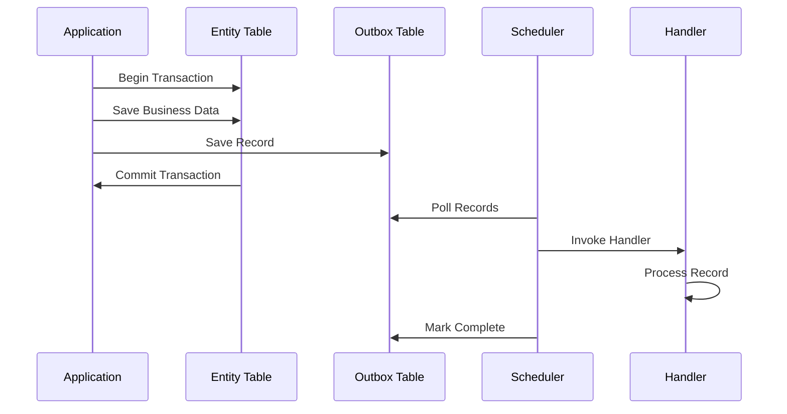
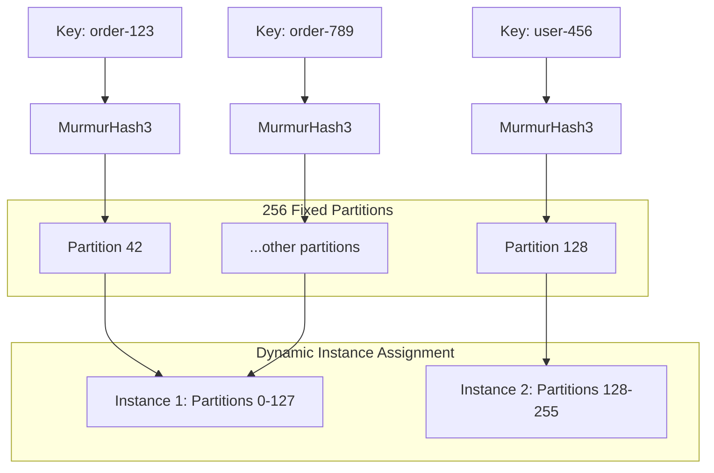

import Tabs from '@theme/Tabs';
import TabItem from '@theme/TabItem';

# Core Features

:::tip Zero Message Loss
The library ensures that domain records are **never lost** by storing them in the same database transaction as your business data. This guarantees consistency between your domain state and persisted records.
:::

### Benefits

- **ACID Compliance**: Records are saved atomically with business data
- **Consistency Guarantee**: No partial updates or lost records
- **Failure Recovery**: System crashes don't result in data loss
- **Reliable Processing**: Records are processed with automatic retry logic

### How it Works



---

## Record Ordering

:::note Guaranteed Processing Order
Records with the same key are **always processed in creation order**, ensuring business logic consistency and preventing race conditions.
:::

**Key Benefits:**

- **Aggregate Consistency**: Records with the same key maintain order
- **Business Logic Safety**: Dependent records process in correct sequence
- **Parallel Processing**: Different keys process independently
- **Scalable Design**: No global ordering bottlenecks

### Controlling Failure Behavior

Control how the scheduler handles failures within a key sequence:

<Tabs>
<TabItem value="enabled" label="Enabled (Default)">

```yaml
namastack:
  outbox:
    processing:
      stop-on-first-failure: true
```

**Behavior:**
- When one record fails, processing stops for remaining records with the same key
- Maintains strict ordering within key sequences
- Prevents cascading issues from dependent records
- **Recommended**: When records within a key have dependencies

</TabItem>
<TabItem value="disabled" label="Disabled">

```yaml
namastack:
  outbox:
    processing:
      stop-on-first-failure: false
```

**Behavior:**
- Failed records don't block independent records with the same key
- Maximizes throughput for independent records
- **Recommended**: When records within a key are independent

</TabItem>
</Tabs>

**Behavior Comparison:**

| Configuration    | Record 1                 | Record 2               | Record 3                 | Result                           |
|------------------|--------------------------|------------------------|--------------------------|----------------------------------|
| `true` (default) | ✓ Success                | ✗ Fails                | ⏸ Skipped                | Record 2 retried, Record 3 waits |
| `false`          | ✓ Success                | ✗ Fails                | ✓ Success                | Record 2 retried independently   |

---

## Hash-based Partitioning

Instead of distributed locking, the library uses **hash-based partitioning** to enable horizontal scaling across multiple instances while maintaining strict record ordering per key. This approach eliminates lock contention and provides better performance.

### How Partitioning Works



### Key Benefits

- **Consistent Hashing**: Each key always maps to the same partition using MurmurHash3
- **No Lock Contention**: Eliminates distributed lock overhead and deadlock risks
- **Horizontal Scaling**: Partitions automatically redistribute when instances join/leave
- **Load Balancing**: Even distribution of partitions across all active instances
- **Ordering Guarantee**: Records within the same key process in strict order
- **Better Performance**: No lock acquisition/renewal overhead

### Partition Assignment

256 fixed partitions provide fine-grained load distribution. Partitions are automatically distributed among active instances. Each key always maps to the same partition.

```kotlin
val partition = PartitionHasher.getPartitionForAggregate("order-123")
```

### Instance Coordination

Instances automatically coordinate partition assignments and rebalance when topology changes. Configuration controls how aggressive this coordination is:

```yaml
namastack:
  outbox:
    instance:
      heartbeat-interval-seconds: 5            # How often each instance sends a heartbeat
      stale-instance-timeout-seconds: 30       # When an instance is considered stale and removed
      graceful-shutdown-timeout-seconds: 0     # Optional: propagation window on shutdown (default: 0)
      rebalance-interval: 10000                # How often partitions are recalculated
```

<Tabs>
<TabItem value="3instances" label="3 Instances">

```
Instance 1: Partitions 0-84   (85 partitions)
Instance 2: Partitions 85-169 (85 partitions)
Instance 3: Partitions 170-255 (86 partitions)
```

</TabItem>
<TabItem value="instance2down" label="Instance 2 Goes Down">

```
Instance 1: Partitions 0-84, 170-211   (127 partitions)
Instance 3: Partitions 85-169, 212-255 (129 partitions)
```
**🔄 Automatic Rebalancing**: Partitions from failed instances are redistributed

</TabItem>
<TabItem value="newinstance" label="New Instance Joins">

```
Instance 1: Partitions 0-63    (64 partitions)
Instance 2: Partitions 64-127  (64 partitions)
Instance 3: Partitions 128-191 (64 partitions)
Instance 4: Partitions 192-255 (64 partitions)
```
**⚖️ Load Balancing**: Partitions are redistributed evenly

</TabItem>
</Tabs>
