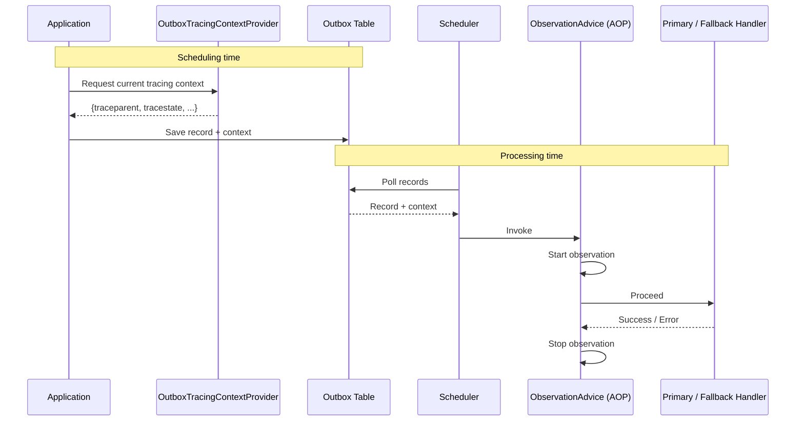

import Tabs from '@theme/Tabs';
import TabItem from '@theme/TabItem';
import VersionedCode from '@site/src/components/VersionedCode';

# Monitoring & Observability

## Metrics Module

The `namastack-outbox-metrics` module provides automatic integration with Spring Boot Actuator and Micrometer:

<Tabs>
<TabItem value="gradle" label="Gradle">

<VersionedCode language="kotlin" template= {`dependencies {
      implementation("io.namastack:namastack-outbox-starter-jpa:{{versionLabel}}")
      implementation("io.namastack:namastack-outbox-metrics:{{versionLabel}}")
      // For Prometheus endpoint (optional)
      implementation("io.micrometer:micrometer-registry-prometheus")
}`} />

</TabItem>
<TabItem value="maven" label="Maven">

<VersionedCode language="xml" template= {`<dependency>
      <groupId>io.namastack</groupId>
      <artifactId>namastack-outbox-metrics</artifactId>
      <version>{{versionLabel}}</version>
</dependency>`} />

</TabItem>
</Tabs>

---

### Built-in Metrics

| Metric                                    | Description                              | Tags                            |
|-------------------------------------------|------------------------------------------|---------------------------------|
| `outbox.records.count`                    | Number of outbox records                 | `status=new\|failed\|completed` |
| `outbox.partitions.assigned.count`        | Partitions assigned to this instance     | -                               |
| `outbox.partitions.pending.records.total` | Total pending records across partitions  | -                               |
| `outbox.partitions.pending.records.max`   | Maximum pending records in any partition | -                               |
| `outbox.cluster.instances.total`          | Total active instances in cluster        | -                               |

:::info Endpoints

- `/actuator/metrics/outbox.records.count`
- `/actuator/metrics/outbox.partitions.assigned.count`
- `/actuator/prometheus` (if Prometheus enabled)

:::

---

## Programmatic Monitoring

<Tabs>
<TabItem value="kotlin" label="Kotlin">

```kotlin
@Service
class OutboxMonitoringService(
    private val outboxRepository: OutboxRecordRepository,
    private val partitionMetricsProvider: OutboxPartitionMetricsProvider
) {
    fun getPendingRecordCount(): Long =
        outboxRepository.countByStatus(OutboxRecordStatus.NEW)
    fun getFailedRecordCount(): Long =
        outboxRepository.countByStatus(OutboxRecordStatus.FAILED)
    fun getPartitionStats(): PartitionProcessingStats =
        partitionMetricsProvider.getProcessingStats()
    fun getClusterStats(): PartitionStats =
        partitionMetricsProvider.getPartitionStats()
}
```

</TabItem>
<TabItem value="java" label="Java">

```java
@Service
public class OutboxMonitoringService {
    private final OutboxRecordRepository outboxRepository;
    private final OutboxPartitionMetricsProvider partitionMetricsProvider;

    public OutboxMonitoringService(OutboxRecordRepository outboxRepository,
                                   OutboxPartitionMetricsProvider partitionMetricsProvider) {
        this.outboxRepository = outboxRepository;
        this.partitionMetricsProvider = partitionMetricsProvider;
    }
    public long getPendingRecordCount() {
        return outboxRepository.countByStatus(OutboxRecordStatus.NEW);
    }
    public long getFailedRecordCount() {
        return outboxRepository.countByStatus(OutboxRecordStatus.FAILED);
    }
    public PartitionProcessingStats getPartitionStats() {
        return partitionMetricsProvider.getProcessingStats();
    }
    public PartitionStats getClusterStats() {
        return partitionMetricsProvider.getPartitionStats();
    }
}
```

</TabItem>
</Tabs>

---

## Observations & Tracing

The `namastack-outbox-tracing` module wraps every handler and fallback handler invocation in a
[Micrometer Observation](https://micrometer.io/docs/observation), giving you distributed traces,
metrics, and structured log correlation out of the box.

### Setup

<Tabs>
<TabItem value="gradle" label="Gradle">

<VersionedCode language="kotlin" template= {`dependencies {
      implementation("io.namastack:namastack-outbox-starter-jpa:{{versionLabel}}")
      implementation("io.namastack:namastack-outbox-tracing:{{versionLabel}}")
      // Tracing bridge of your choice, e.g. OpenTelemetry
      implementation("org.springframework.boot:spring-boot-starter-opentelemetry")
}`} />

</TabItem>
<TabItem value="maven" label="Maven">

<VersionedCode language="xml" template= {`<dependency>
      <groupId>io.namastack</groupId>
      <artifactId>namastack-outbox-tracing</artifactId>
      <version>{{versionLabel}}</version>
</dependency>`} />

</TabItem>
</Tabs>

The module auto-configures when both a `Tracer` and a `Propagator` bean are present (provided by
any Spring Boot tracing bridge such as OpenTelemetry or Brave).

---

### How It Works

The module handles tracing across **both** sides of the async boundary:



**At scheduling time**, `OutboxTracingContextProvider` serializes the active span context into the
outbox record's `context` map using the configured Micrometer `Propagator` (W3C Trace Context
format by default, producing `traceparent`, `tracestate`, and optional baggage headers). These
headers are persisted alongside the record in the database. If no active span exists or
serialization fails, an empty map is stored and scheduling continues unblocked.

**At processing time**, each polled record passes through an AOP advice that:
1. Reads the propagation headers stored in `record.context` (e.g. `traceparent`, `tracestate`).
2. Creates a child span under the original producer trace so the whole flow is visible end-to-end.
3. Attaches observation tags (see table below) and stops the observation when the handler returns.

This applies to **both** the primary handler and the fallback handler, each producing its own span.

---

### Observation

| Property        | Value                      |
|-----------------|----------------------------|
| Name            | `outbox.record.process`    |
| Contextual name | `outbox process`           |

#### Tags

**Low-cardinality** (safe to use as metric/trace dimensions):

| Tag key              | Values                 | Description                                              |
|----------------------|------------------------|----------------------------------------------------------|
| `outbox.handler.kind`| `primary` / `fallback` | Whether the primary or fallback handler processed the record |
| `outbox.handler.id`  | handler name           | Identifier of the handler that processed the record      |

**High-cardinality** (for traces and log correlation only, not metric dimensions):

| Tag key                  | Example value                          | Description                                          |
|--------------------------|----------------------------------------|------------------------------------------------------|
| `outbox.record.id`       | `3fa85f64-5717-4562-b3fc-2c963f66afa6` | Unique identifier (UUID) of the outbox record        |
| `outbox.record.key`      | `order-42`                             | Business key of the outbox record                    |
| `outbox.delivery.attempt`| `2`                                    | Current attempt number (`failureCount + 1`)          |

:::tip See also

For details on how trace headers are stored in and read from `record.context`, how to add your
own context alongside tracing (e.g. tenant ID, correlation ID), or how to manually override
context at scheduling time, see [Context Propagation](./context-propagation.md).

:::

