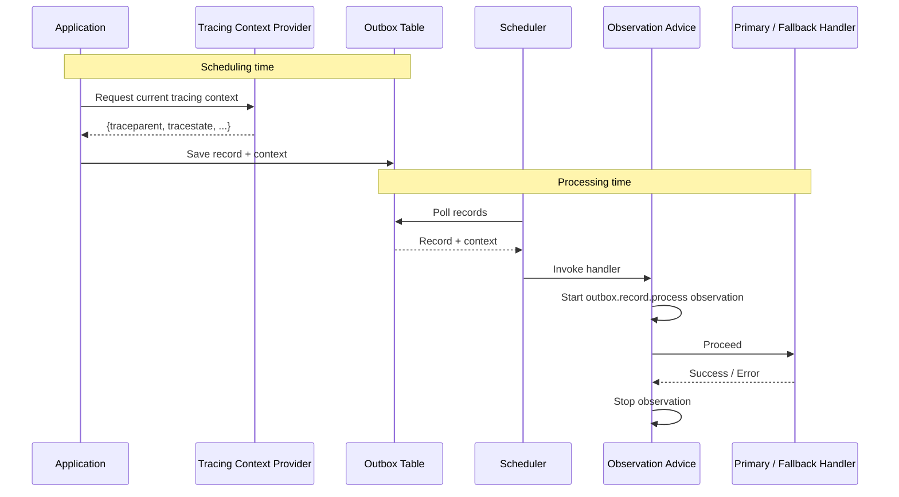

import Tabs from '@theme/Tabs';
import TabItem from '@theme/TabItem';
import VersionedCode from '@site/src/components/VersionedCode';

# Observability

The `namastack-outbox-observability` module is the current observability integration for
Namastack Outbox. It provides:

- Micrometer observations for record scheduling and record processing
- timer metrics derived from those observations
- trace propagation across the transactional outbox boundary
- instance and cluster gauges for operational state
- one shared tag schema for metrics and traces

:::warning Deprecated modules

The old `namastack-outbox-metrics` and `namastack-outbox-tracing` modules are deprecated.
Use `namastack-outbox-observability` for new applications.

The legacy modules remain available for users who need the old metric names or tracing setup, but
new features and metric naming improvements are provided by the observability module.

:::

## Setup

Add the observability module together with your outbox starter. If you want to export Prometheus
metrics, also add the Prometheus Micrometer registry.

<Tabs>
<TabItem value="gradle" label="Gradle">

<VersionedCode language="kotlin" template= {`dependencies {
      implementation("io.namastack:namastack-outbox-starter-jpa:{{versionLabel}}")
      implementation("io.namastack:namastack-outbox-observability:{{versionLabel}}")

      // For Prometheus endpoint (optional)
      implementation("io.micrometer:micrometer-registry-prometheus")

      // For distributed tracing (optional, choose your tracing bridge)
      implementation("org.springframework.boot:spring-boot-starter-opentelemetry")
}`} />

</TabItem>
<TabItem value="maven" label="Maven">

<VersionedCode language="xml" template= {`<dependency>
      <groupId>io.namastack</groupId>
      <artifactId>namastack-outbox-observability</artifactId>
      <version>{{versionLabel}}</version>
</dependency>

<!-- For Prometheus endpoint (optional) -->
<dependency>
      <groupId>io.micrometer</groupId>
      <artifactId>micrometer-registry-prometheus</artifactId>
</dependency>

<!-- For distributed tracing (optional, choose your tracing bridge) -->
<dependency>
      <groupId>org.springframework.boot</groupId>
      <artifactId>spring-boot-starter-opentelemetry</artifactId>
</dependency>`} />

</TabItem>
</Tabs>

The module auto-configures when:

- `OutboxService` is on the classpath
- a Micrometer `ObservationRegistry` is available
- `namastack.outbox.enabled=true` (the default)

Tracing context propagation is enabled automatically when Micrometer `Tracer` and `Propagator`
beans are present.

## Metrics

The observability module exposes two kinds of metrics:

- **Observation-based timers** for actual scheduling and processing work
- **Gauge metrics** for current outbox state

Observation-based metrics are event-driven. They measure real calls to `Outbox.schedule(...)` and
handler dispatches. Gauges are state snapshots, read when your metrics backend scrapes the
application.

### Observation Metrics

| Metric | Type | Description | Low-cardinality tags |
|--------|------|-------------|----------------------|
| `outbox.record.schedule` | timer | Time spent scheduling one outbox operation | `outbox.channel` |
| `outbox.record.process` | timer | Time spent dispatching one outbox record to a primary or fallback handler | `outbox.channel`, `outbox.handler.kind`, `outbox.handler.id` |

Use these metrics for latency, throughput, and error monitoring:

- throughput: rate of timer count
- latency: timer percentiles or max
- error rate: timer count grouped by the Micrometer error/exception tags provided by your metrics setup
- handler-level analysis: group `outbox.record.process` by `outbox.handler.kind` and `outbox.handler.id`

Example PromQL:

```promql
rate(outbox_record_process_seconds_count[5m])
```

```promql
histogram_quantile(0.95, rate(outbox_record_process_seconds_bucket[5m]))
```

```promql
sum by (outbox_handler_id, outbox_handler_kind) (
  rate(outbox_record_process_seconds_count[5m])
)
```

:::note Metric names in Prometheus

Micrometer converts dotted meter names to Prometheus naming conventions. For example,
`outbox.record.process` is usually exported as `outbox_record_process_seconds`.

:::

### Gauge Metrics

| Metric | Description | Tags |
|--------|-------------|------|
| `outbox.records` | Count of outbox records by status | `outbox.channel`, `outbox.record.status=new\|failed\|completed` |
| `outbox.instance.partitions.assigned` | Number of partitions assigned to this application instance | `outbox.channel` |
| `outbox.instance.records.pending` | Total pending records across partitions assigned to this instance | `outbox.channel` |
| `outbox.cluster.instances.active` | Number of active outbox instances in the cluster | `outbox.channel` |
| `outbox.cluster.partitions.unassigned` | Number of partitions not assigned to any active instance | `outbox.channel` |

Use gauges for operational state:

- backlog: `outbox.records{outbox.record.status="new"}`
- failed records: `outbox.records{outbox.record.status="failed"}`
- per-instance pressure: `outbox.instance.records.pending`
- cluster health: `outbox.cluster.instances.active` and `outbox.cluster.partitions.unassigned`

:::info Actuator endpoints

Common Spring Boot Actuator endpoints:

- `/actuator/metrics/outbox.record.process`
- `/actuator/metrics/outbox.record.schedule`
- `/actuator/metrics/outbox.records`
- `/actuator/metrics/outbox.instance.records.pending`
- `/actuator/prometheus` (if Prometheus is enabled)

:::

## Tag Schema

The module uses one shared tag schema across observations and metrics.

### Low-Cardinality Tags

Low-cardinality tags are safe for metric dimensions.

| Tag key | Values | Used by | Description |
|---------|--------|---------|-------------|
| `outbox.channel` | channel name, defaults to `default` | all outbox metrics | Logical outbox channel |
| `outbox.record.status` | `new`, `failed`, `completed` | `outbox.records` | Record status |
| `outbox.handler.kind` | `primary`, `fallback` | `outbox.record.process` | Whether the primary or fallback handler processed the record |
| `outbox.handler.id` | handler id | `outbox.record.process` | Handler identifier stored with the outbox record |

### High-Cardinality Observation Keys

High-cardinality keys are intended for traces and log correlation. Do not promote them to metric
dimensions unless you fully control their cardinality.

| Key | Used by | Description |
|-----|---------|-------------|
| `outbox.record.id` | `outbox.record.process` | Unique outbox record id |
| `outbox.record.key` | `outbox.record.process` | Business key used for ordering and partitioning |
| `outbox.delivery.attempt` | `outbox.record.process` | Current delivery attempt (`failureCount + 1`) |
| `outbox.schedule.record.key` | `outbox.record.schedule` | Explicit schedule key, or `auto-generated` for overloads without a key argument |
| `outbox.schedule.payload.type` | `outbox.record.schedule` | Simple class name of the scheduled payload |

## Tracing

The observability module preserves tracing across both sides of the async boundary.



At scheduling time, `OutboxObservabilityTracingContextProvider` serializes the active span context
into the outbox record's `context` map using the configured Micrometer `Propagator`. With W3C Trace
Context this usually stores headers such as `traceparent` and `tracestate`.

At processing time, `outbox.record.process` uses a Micrometer receiver context, so the tracing
bridge can read the stored propagation headers and create a child span under the original producer
trace.

This applies to both primary and fallback handlers.

:::tip See also

For details on how trace headers are stored in and read from `record.context`, how to add your own
context alongside tracing, or how to manually override context at scheduling time, see
[Context Propagation](./context-propagation.md).

:::

## Custom Observation Conventions

You can override the default observation naming and tag conventions by registering custom
convention beans.

### Record Processing

Implement `OutboxProcessObservationConvention` to customize `outbox.record.process`.

```kotlin
@Configuration
class CustomOutboxProcessObservationConfig {
    @Bean
    fun customOutboxProcessConvention(): OutboxProcessObservationConvention =
        object : OutboxProcessObservationConvention {
            override fun getName(): String = "myapp.outbox.process"

            override fun getContextualName(context: OutboxProcessObservationContext): String = "outbox process"

            override fun getLowCardinalityKeyValues(context: OutboxProcessObservationContext) =
                KeyValues.of(
                    OutboxObservationDocumentation.LowCardinalityKeyNames.HANDLER_KIND
                        .withValue(context.getHandlerKind().toString()),
                    OutboxObservationDocumentation.LowCardinalityKeyNames.HANDLER_ID
                        .withValue(context.getHandlerId()),
                    OutboxObservationDocumentation.LowCardinalityKeyNames.CHANNEL
                        .withValue(context.getChannel()),
                )

            override fun getHighCardinalityKeyValues(context: OutboxProcessObservationContext) =
                KeyValues.of(
                    OutboxObservationDocumentation.HighCardinalityKeyNames.RECORD_ID
                        .withValue(context.getRecordId()),
                    OutboxObservationDocumentation.HighCardinalityKeyNames.RECORD_KEY
                        .withValue(context.getRecordKey()),
                    OutboxObservationDocumentation.HighCardinalityKeyNames.DELIVERY_ATTEMPT
                        .withValue(context.getDeliveryAttempt().toString()),
                )
        }
}
```

### Record Scheduling

Implement `OutboxScheduleObservationConvention` to customize `outbox.record.schedule`.

```kotlin
@Configuration
class CustomOutboxScheduleObservationConfig {
    @Bean
    fun customOutboxScheduleConvention(): OutboxScheduleObservationConvention =
        object : OutboxScheduleObservationConvention {
            override fun getName(): String = "myapp.outbox.schedule"

            override fun getContextualName(context: OutboxScheduleObservationContext): String = "outbox schedule"

            override fun getLowCardinalityKeyValues(context: OutboxScheduleObservationContext) =
                KeyValues.of(
                    OutboxObservationDocumentation.ScheduleLowCardinalityKeyNames.CHANNEL
                        .withValue(context.channel),
                )

            override fun getHighCardinalityKeyValues(context: OutboxScheduleObservationContext) =
                KeyValues.of(
                    OutboxObservationDocumentation.ScheduleHighCardinalityKeyNames.RECORD_KEY
                        .withValue(context.recordKey),
                    OutboxObservationDocumentation.ScheduleHighCardinalityKeyNames.PAYLOAD_TYPE
                        .withValue(context.payloadType),
                )
        }
}
```

Keep high-cardinality values out of low-cardinality tags to avoid excessive time series in metrics
backends.

## Legacy Metric Names

The deprecated `namastack-outbox-metrics` module used older metric names such as:

- `outbox.records.count`
- `outbox.partitions.assigned.count`
- `outbox.partitions.pending.records.total`
- `outbox.partitions.pending.records.max`
- `outbox.cluster.instances.total`

New applications should use the canonical names from `namastack-outbox-observability` instead.
