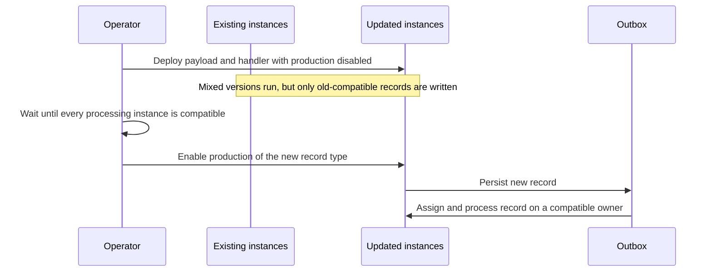

# Rolling Deployments

During a rolling deployment, old and new application versions run at the same time and share the
same outbox. Any active instance can own the partition for a record key. A record written by a new
instance can therefore be read by an older instance before the rollout has finished.

The central compatibility rule is:

> Deploy the code required to read and process a record to every processing instance before any
> instance starts producing that record.

This is the same consumer-before-producer rule used for other asynchronous systems. For outbox
records, the compatibility contract includes the persisted payload type, its serialized shape, the
handler ID, and the serializer configuration.

## Recommended Deployment Sequence

Use a feature flag or another separately controlled switch when a release introduces a payload or
handler that older instances do not support.



1. **Identify the compatibility surface.** Check the payload class name, serialized fields,
   handler ID and aliases, and serializer configuration used by the new record.
2. **Deploy read compatibility first.** Ship the new payload class and handler to every instance,
   but keep production of the new record disabled.
3. **Wait for the rollout and partition topology to settle.** Confirm that every active outbox
   processing instance runs the compatible version. Account for the configured heartbeat,
   stale-instance, and rebalance intervals.
4. **Enable production separately.** Turn on the feature flag only after the compatibility rollout
   is complete.
5. **Observe the rollout.** Check application logs and the number and age of `NEW` and `FAILED`
   records. Compatibility problems remain `NEW`; actual handler failures continue to use the
   configured retry policy.
6. **Remove compatibility code later.** Keep old payload classes and handler aliases until all
   records that reference them have drained and no producing instance can create more.

:::warning Do Not Combine Both Phases
Deploying the new code and immediately producing the new record type reintroduces the race: an old
instance may still own the target partition. Deployment order alone is insufficient because the
new instance may start producing before the final old instance has stopped.
:::

## Compatibility Failures During a Rollout

Namastack Outbox distinguishes an instance compatibility problem from a handler delivery failure.

| Situation                                                          | Result                                                          |
|--------------------------------------------------------------------|-----------------------------------------------------------------|
| The persisted payload type is unavailable on the current instance  | The record remains `NEW`; no delivery retry is consumed         |
| The persisted handler ID is not registered on the current instance | The record remains `NEW`; no delivery retry is consumed         |
| A registered handler is invoked and throws                         | The normal retry, fallback, and permanent-failure chain applies |

When an instance encounters an unavailable payload type or handler, it logs the affected record
and pauses new polling on that scheduler instance for 30 seconds. Record-key tasks that were
already submitted in the current batch can finish normally. After the cooldown, the scheduler
queries another batch and reevaluates the pending record.

The persisted root payload class is resolved before deserialization, so an unavailable root type is
always detected by the built-in repositories. A referenced type may be resolved only inside the
configured serializer. In that case, compatibility handling applies when the serializer propagates
the JVM `LinkageError`. Serializer-specific failures cannot be classified generically and retain the
normal deserialization-error behavior.

Other failures that occur after the payload class was loaded, such as invalid payload or context
data, are outside this compatibility safeguard and continue through the existing scheduler error
path.

This behavior has several consequences:

- `failureCount`, `nextRetryAt`, `failureReason`, the serialized payload, and its persisted type are
  not changed.
- The record cannot become `FAILED` merely because the current instance lacks application code.
- An unavailable payload type or handler stops the affected record key immediately, regardless of
  `stop-on-first-failure`. This setting controls failures from invoked handlers; compatibility
  failures occur before a delivery attempt and are treated as a key-level barrier.
- Other record keys already submitted in the current batch can still be processed. New batches for
  all partitions owned by that scheduler instance wait until the cooldown expires.
- The cooldown belongs to one scheduler instance and is not persisted. A restarted or replacement
  instance reevaluates the unchanged record without inheriting it.
- A compatibility problem that is never fixed remains pending. Namastack Outbox cannot determine
  whether missing application code is temporary, was removed intentionally, or indicates an
  invalid persisted identifier.

The cooldown deliberately has a wider impact than the incompatible record: compatible work that
was not part of the current batch can be delayed. It prevents a short polling interval from causing
continuous database queries and warnings while keeping the safeguard small and predictable. It
does not replace the expand-and-contract deployment sequence.

:::note Materialization of Records for One Key
The built-in repositories currently materialize all selected records for a key before processing
starts. If a later record uses an unavailable payload class, compatible predecessors loaded with it
may remain pending until a compatible instance owns the partition. The records are not lost or
processed out of order.
:::

## Adding a Payload Type or Handler

Use two phases for both a new payload type and a new handler for an existing payload type:

1. Deploy the payload class and registered handler everywhere while production remains disabled.
2. Verify that all processing instances have completed the rollout.
3. Enable the code path that schedules the new records.

```kotlin
if (features.newOrderExportEnabled) {
    outbox.schedule(OrderExportRequested(order.id), "order-${order.id}")
}
```

The feature flag controls record creation. The payload class and handler must be present regardless
of the flag value so that every instance can process records created elsewhere.

## Changing a Handler ID

Handler IDs are persisted with records. Use aliases so that every version deployed during the
migration accepts both the old and new ID:

1. Keep the old ID canonical and add the future ID as an alias. Deploy this version everywhere.
2. Make the new ID canonical and retain the old ID as an alias.
3. Remove the old alias only after all old records have drained and no old application instance is
   running.

See [Migrating an ID Safely](handlers.md#migrating-an-id-safely) for Kotlin and Java examples.

## Changing a Payload

The fully qualified payload class name is stored as the record type. The serialized data must also
remain readable by every version that can receive the record.

For additive changes, prefer optional fields or defaults and deploy readers before writers start
populating the new fields. Before making a breaking shape change, introduce a new payload type and
use the two-phase rollout described above.

Renaming or moving a payload class changes its persisted type name. Keep the old class available
until records using its old name have drained. If retaining both class names is not practical, stop
producing the old type, drain it completely, and only then perform the rename.

## Removing a Payload Type or Handler

Removal uses the reverse order of an additive rollout:

1. Disable every producer of the old record type or handler ID.
2. Wait until all instances capable of producing it have been replaced or stopped.
3. Wait until all pending records using the old payload type or handler ID have completed.
4. Remove the handler, its aliases, and the payload class in a later release.

Do not infer that draining is complete from a quiet polling interval. Verify the persisted outbox
state and include delayed retries when checking for remaining records.

## Upgrading the Compatibility Behavior

An instance running an older Namastack Outbox version does not have the compatibility handling
described on this page. In particular, it may treat a missing handler as a delivery failure.

When introducing this behavior into an existing deployment:

1. Upgrade the Namastack Outbox library on every instance without producing new payload types or
   handler IDs.
2. Wait until no instance using the older library remains active.
3. Roll out the application capability with production disabled.
4. Enable production only after every processing instance supports it.

## Rollbacks

A rollback target must be able to read and route every record that may already exist in the outbox.
Keep new payload classes, compatible deserialization, and handler registrations in the rollback
artifact for as long as the new producer can run.

If the rollback version cannot include that compatibility:

1. Disable production of the new records.
2. Keep compatible instances running until those records have drained.
3. Roll back the remaining instances only after the outbox no longer contains the new contract.

If an incompatible instance encounters such a record, the record remains pending rather than
exhausting its delivery retry budget. Processing resumes after a compatible instance owns the
partition. This protects the record, but it does not replace a planned rollback procedure.

## Operational Checklist

Before enabling a new record contract, verify all of the following:

- Every active processing instance contains the payload class and handler.
- Every instance accepts all handler IDs that may already be stored, including migration aliases.
- The serializer can read payloads written by both the old and new application versions.
- No old instance remains active according to the heartbeat and stale-instance settings.
- Partition rebalancing has completed after the last instance change.
- Rollback artifacts retain the same read compatibility.
- Logs and pending-record counts are monitored throughout the rollout.

If a compatibility warning persists, restore the missing code or registration, correct the
deployment configuration, or explicitly resolve the affected record according to your operational
policy. The library intentionally does not convert an unknown compatibility problem into a
permanent delivery failure.
