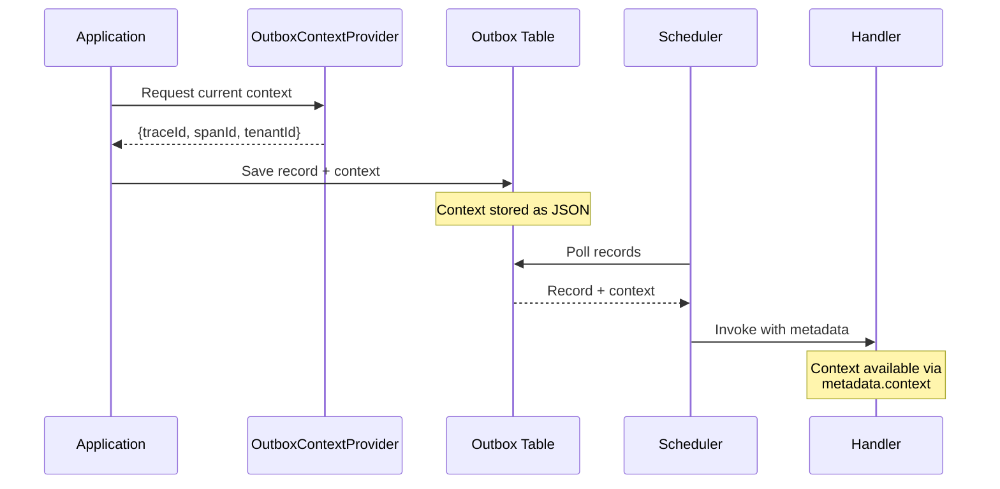

import Tabs from '@theme/Tabs';
import TabItem from '@theme/TabItem';

# Context Propagation

Context propagation preserves important metadata (trace IDs, tenant info, correlation IDs, user context) across the async boundary between scheduling and processing.

## How It Works

Context is captured when records are scheduled and restored when handlers are invoked:



---

## OutboxContextProvider Interface

<Tabs>
<TabItem value="kotlin" label="Kotlin">

```kotlin
@Component
class TracingContextProvider(
    private val tracer: Tracer
) : OutboxContextProvider {
    override fun provide(): Map<String, String> {
        val currentSpan = tracer.currentSpan() ?: return emptyMap()
        return mapOf(
            "traceId" to currentSpan.context().traceId(),
            "spanId" to currentSpan.context().spanId()
        )
    }
}

@Component
class TenantContextProvider : OutboxContextProvider {
    override fun provide(): Map<String, String> {
        val tenantId = SecurityContextHolder.getContext()
            .authentication
            ?.principal
            ?.let { (it as? TenantAware)?.tenantId }
            ?: return emptyMap()
        return mapOf("tenantId" to tenantId)
    }
}
```

</TabItem>
<TabItem value="java" label="Java">

```java
@Component
public class TracingContextProvider implements OutboxContextProvider {
    private final Tracer tracer;
    public TracingContextProvider(Tracer tracer) {
        this.tracer = tracer;
    }
    @Override
    public Map<String, String> provide() {
        Span currentSpan = tracer.currentSpan();
        if (currentSpan == null) {
            return Collections.emptyMap();
        }
        return Map.of(
            "traceId", currentSpan.context().traceId(),
            "spanId", currentSpan.context().spanId()
        );
    }
}

@Component
public class TenantContextProvider implements OutboxContextProvider {
    @Override
    public Map<String, String> provide() {
        Authentication auth = SecurityContextHolder.getContext().getAuthentication();
        if (auth == null || !(auth.getPrincipal() instanceof TenantAware)) {
            return Collections.emptyMap();
        }
        String tenantId = ((TenantAware) auth.getPrincipal()).getTenantId();
        return Map.of("tenantId", tenantId);
    }
}
```

</TabItem>
</Tabs>

**Multiple Providers:**

You can register multiple `OutboxContextProvider` beans. The library automatically merges all context maps. If keys collide, the last provider wins.

---

## Accessing Context in Handlers

<Tabs>
<TabItem value="kotlin" label="Kotlin">

```kotlin
@Component
class OrderHandler {
    @OutboxHandler
    fun handle(payload: OrderEvent, metadata: OutboxRecordMetadata) {
        // Access context via metadata.context
        val traceId = metadata.context["traceId"]
        val spanId = metadata.context["spanId"]
        val tenantId = metadata.context["tenantId"]
        
        // Restore tracing context for downstream calls
        tracer.withSpan(traceId, spanId) {
            logger.info("Processing order ${payload.orderId} [trace: $traceId]")
            orderService.process(payload)
        }
    }
    
    @OutboxFallbackHandler
    fun handleFailure(payload: OrderEvent, context: OutboxFailureContext) {
        // Access context via failureContext.context
        val traceId = context.context["traceId"]
        
        logger.error(
            "Order ${payload.orderId} failed permanently [trace: $traceId]",
            context.lastException
        )
        
        deadLetterQueue.publish(
            payload = payload,
            context = mapOf("traceId" to traceId)
        )
    }
}
```

</TabItem>
<TabItem value="java" label="Java">

```java
@Component
public class OrderHandler {
    @OutboxHandler
    public void handle(OrderEvent payload, OutboxRecordMetadata metadata) {
        // Access context via metadata.context
        String traceId = metadata.getContext().get("traceId");
        String spanId = metadata.getContext().get("spanId");
        String tenantId = metadata.getContext().get("tenantId");
        
        // Restore tracing context for downstream calls
        tracer.withSpan(traceId, spanId, () -> {
            logger.info("Processing order {} [trace: {}]", payload.getOrderId(), traceId);
            orderService.process(payload);
        });
    }
    
    @OutboxFallbackHandler
    public void handleFailure(OrderEvent payload, OutboxFailureContext context) {
        // Access context via failureContext.context
        String traceId = context.getContext().get("traceId");
        
        logger.error(
            "Order {} failed permanently [trace: {}]",
            payload.getOrderId(),
            traceId,
            context.getLastException()
        );
        
        deadLetterQueue.publish(payload, Map.of("traceId", traceId));
    }
}
```

</TabItem>
</Tabs>

---

## Manual Context Override

<Tabs>
<TabItem value="kotlin" label="Kotlin">

```kotlin
@Service
class OrderService(private val outbox: Outbox) {
    @Transactional
    fun createOrder(command: CreateOrderCommand) {
        val order = Order.create(command)
        orderRepository.save(order)
        
        // Override or extend context
        outbox.schedule(
            payload = OrderCreatedEvent(order.id, order.customerId),
            key = "order-${order.id}",
            context = mapOf(
                "correlationId" to command.correlationId,
                "userId" to command.userId,
                "priority" to "high"
            )
        )
    }
}
```

</TabItem>
<TabItem value="java" label="Java">

```java
@Service
public class OrderService {
    private final Outbox outbox;
    @Transactional
    public void createOrder(CreateOrderCommand command) {
        Order order = Order.create(command);
        orderRepository.save(order);
        
        // Override or extend context
        outbox.schedule(
            new OrderCreatedEvent(order.getId()),
            "order-" + order.getId(),
            Map.of(
                "correlationId", command.getCorrelationId(),
                "userId", command.getUserId(),
                "priority", "high"
            )
        );
    }
}
```

</TabItem>
</Tabs>

**Context Merging:**

When you provide manual context, it's merged with context from registered `OutboxContextProvider` beans. Manual context takes precedence for duplicate keys.

---

## Use Cases

**Common use cases for context propagation:**

1. **Distributed Tracing**: Preserve trace and span IDs across async boundaries
2. **Multi-Tenancy**: Maintain tenant context for data isolation
3. **Correlation IDs**: Track requests across service boundaries
4. **User Context**: Preserve user identity for audit logging
5. **Feature Flags**: Propagate feature flag states for consistent behavior
6. **Request Metadata**: Pass request IDs, client info, API versions
