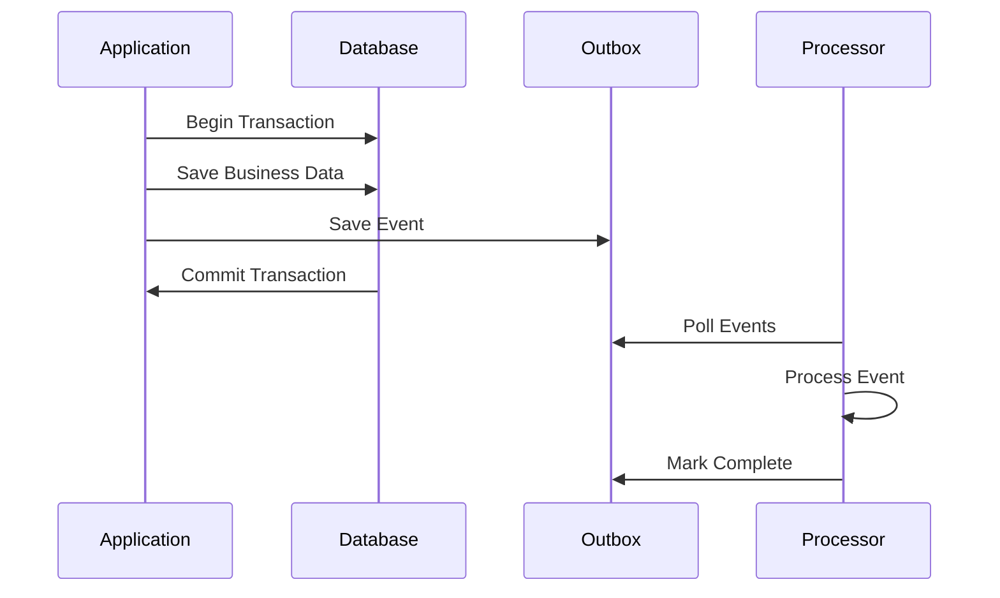

# Features

Spring Outbox provides a comprehensive set of features to implement the Outbox Pattern in distributed systems with reliability, scalability, and ease of use.

## :material-check-circle: Core Features

### :material-database-sync: Transactional Outbox Pattern

!!! success "Zero Message Loss"
    The library ensures that domain events are **never lost** by storing them in the same database transaction as your business data. This guarantees consistency between your domain state and published events.

#### Benefits

- **ACID Compliance**: Events are saved atomically with business data
- **Consistency Guarantee**: No partial updates or lost events
- **Failure Recovery**: System crashes don't result in data loss
- **Exactly-once semantics**: Events are processed reliably

#### How it Works



### :material-lock: Distributed Locking

!!! info "Concurrent Processing Prevention"
    Each aggregate gets its own distributed lock to prevent multiple instances from processing the same events simultaneously while allowing different aggregates to be processed in parallel.

=== "Features"
    - **Per-Aggregate Locking**: Fine-grained control prevents bottlenecks
    - **Automatic Expiration**: Locks expire to prevent deadlocks
    - **Lock Renewal**: Active processors can extend their locks
    - **Optimistic Locking**: Prevents race conditions during renewal
    - **Horizontal Scaling**: Multiple instances can work on different aggregates

=== "Configuration"
    ```yaml
    outbox:
      locking:
        extension-seconds: 300     # Lock duration (5 minutes)
        refresh-threshold: 60      # Renew when < 60s remaining
    ```

### :material-sort-numeric-ascending: Event Ordering

!!! note "Guaranteed Processing Order"
    Events for the same aggregate are **always processed in creation order**, ensuring business logic consistency and preventing race conditions.

**Key Benefits:**

- :material-arrow-right: **Aggregate Consistency**: Events within an aggregate maintain order
- :material-arrow-right: **Business Logic Safety**: Dependent events process in correct sequence  
- :material-arrow-right: **Parallel Aggregates**: Different aggregates process independently
- :material-arrow-right: **Scalable Design**: No global ordering bottlenecks

Control how the scheduler handles failures within aggregates:

!!! example "Stop on First Failure"

    === "Enabled (Default)"
        ```yaml
        outbox:
          processing:
            stop-on-first-failure: true
        ```
        
        - When one event fails, processing stops for remaining events in that aggregate
        - Maintains strict event ordering within aggregates
        - Prevents cascading issues from dependent events
        - **Recommended**: When events within an aggregate have dependencies
    
    === "Disabled"
        ```yaml
        outbox:
          processing:
            stop-on-first-failure: false
        ```
        
        - Failed events don't block independent events in the same aggregate
        - Maximizes throughput for independent events
        - **Recommended**: When events within an aggregate are independent

**Behavior Comparison:**

| Configuration    | Event 1                  | Event 2                | Event 3                  | Result                         |
|------------------|--------------------------|------------------------|--------------------------|--------------------------------|
| `true` (default) | :material-check: Success | :material-close: Fails | :material-pause: Skipped | Event 2 retried, Event 3 waits |
| `false`          | :material-check: Success | :material-close: Fails | :material-check: Success | Event 2 retried independently  |

## :material-cog: Advanced Configuration

### :material-refresh: Retry Mechanisms

The library provides sophisticated retry strategies to handle transient failures gracefully.

=== "Fixed Delay"
    ```yaml
    outbox:
      retry:
        policy: "fixed"
        max-retries: 5
        fixed:
          delay: 5000  # 5 seconds between retries
    ```
    
    **Use Case**: Simple scenarios with consistent retry intervals

=== "Exponential Backoff" 
    ```yaml
    outbox:
      retry:
        policy: "exponential"
        max-retries: 10
        exponential:
          initial-delay: 1000    # Start with 1 second
          max-delay: 300000      # Cap at 5 minutes
          multiplier: 2.0        # Double each time
    ```
    
    **Retry Schedule**: 1s → 2s → 4s → 8s → 16s → ... (up to max-delay)

=== "Jittered Retry"
    ```yaml
    outbox:
      retry:
        policy: "jittered"
        max-retries: 7
        jittered:
          base-policy: exponential
          jitter: 1000           # Add 0-1000ms random delay
        exponential:
          initial-delay: 2000
          max-delay: 60000
          multiplier: 2.0
    ```
    
    **Benefits**: Prevents thundering herd problems in high-traffic systems

## :material-chart-line: Monitoring & Observability

### :material-package-down: Including the Metrics Module

!!! info "Add Dependency"
    To enable monitoring and observability features, include the `spring-outbox-metrics` module in your project:

=== "Gradle"
    ```kotlin
    dependencies {
        implementation("io.namastack:spring-outbox-starter-jpa")
        implementation("io.namastack:spring-outbox-metrics")
        
        // For Prometheus endpoint (optional)
        implementation("io.micrometer:micrometer-registry-prometheus")
    }
    ```

=== "Maven"
    ```xml
    <dependencies>
        <dependency>
            <groupId>io.namastack</groupId>
            <artifactId>spring-outbox-starter-jpa</artifactId>
            <version>${spring-outbox.version}</version>
        </dependency>
        <dependency>
            <groupId>io.namastack</groupId>
            <artifactId>spring-outbox-metrics</artifactId>
            <version>${spring-outbox.version}</version>
        </dependency>
        
        <!-- For Prometheus endpoint (optional) -->
        <dependency>
            <groupId>io.micrometer</groupId>
            <artifactId>micrometer-registry-prometheus</artifactId>
        </dependency>
    </dependencies>
    ```

### :material-monitor-dashboard: Built-in Metrics

!!! tip "Micrometer Integration"
    The `spring-outbox-metrics` module provides automatic integration with Spring Boot Actuator and Micrometer.

=== "Available Metrics"
    | Metric | Description | Tags |
    |--------|-------------|------|
    | `outbox.records.count` | Number of outbox records | `status=new\|failed\|completed` |
    
    **Endpoints:**
    
    - :material-api: `/actuator/metrics/outbox.records.count`
    - :material-chart-box: `/actuator/prometheus` (if Prometheus enabled)

=== "Prometheus Format"
    ```prometheus
    outbox_records_count{status="new"} 42
    outbox_records_count{status="failed"} 3  
    outbox_records_count{status="completed"} 1337
    ```

=== "Query Examples"
    ```bash
    # Get current metrics
    curl http://localhost:8080/actuator/metrics/outbox.records.count
    
    # Prometheus endpoint
    curl http://localhost:8080/actuator/prometheus | grep outbox
    ```

### :material-database-search: Status Monitoring

Monitor outbox status programmatically:

```kotlin
@Service
class OutboxMonitoringService(
    private val outboxRepository: OutboxRecordRepository
) {
    fun getPendingEvents(): List<OutboxRecord> = 
        outboxRepository.findPendingRecords()
        
    fun getFailedEvents(): List<OutboxRecord> = 
        outboxRepository.findFailedRecords()
        
    fun getCompletedEvents(): List<OutboxRecord> = 
        outboxRepository.findCompletedRecords()
}
```

## :material-lightning-bolt: Performance Features

### :material-rocket: High Throughput

!!! performance "Optimized for Scale"
    - **Batch Processing**: Multiple events processed efficiently
    - **Connection Pooling**: Database connections managed optimally  
    - **Minimal Overhead**: Lightweight processing with low latency
    - **Concurrent Aggregates**: Parallel processing across different aggregates

### :material-shield-check: Race Condition Safety

=== "Optimistic Locking"
    - Uses database-level optimistic locking
    - Prevents concurrent modifications
    - Automatic retry on version conflicts
    - No performance penalty for read operations

=== "Lock-Free Aggregates"
    - Different aggregates process independently
    - No global locks or bottlenecks
    - Scales horizontally across instances
    - Maintains per-aggregate ordering guarantees

## :material-code-braces: Developer Experience

### :material-puzzle: Easy Integration

!!! success "Minimal Setup Required"
    
    1. **Add Dependency**: Single JAR includes everything needed
    2. **Enable Annotation**: `@EnableOutbox` activates all features  
    3. **Configure Database**: Automatic schema creation available
    4. **Implement Processor**: Simple interface for event handling

=== "Builder Pattern"
    ```kotlin
    val outboxRecord = OutboxRecord.Builder()
        .aggregateId(order.id.toString())
        .eventType("OrderCreated")
        .payload(objectMapper.writeValueAsString(event))
        .build(clock)
    ```

=== "Restore Pattern"
    ```kotlin
    val outboxRecord = OutboxRecord.restore(
        id = UUID.randomUUID().toString(),
        aggregateId = order.id.toString(),
        eventType = "OrderCreated",
        payload = objectMapper.writeValueAsString(event),
        createdAt = OffsetDateTime.now(clock),
        status = OutboxRecordStatus.NEW,
        completedAt = null,
        retryCount = 0,
        nextRetryAt = OffsetDateTime.now(clock)
    )
    ```

### :material-test-tube: Testing Support

- **Unit Tests**: All components with high coverage
- **Integration Tests**: Real database and locking scenarios  
- **Concurrency Tests**: Race condition validation
- **Performance Tests**: High-throughput scenarios

```bash
./gradlew test
```

## :material-database: Database Support

!!! info "Broad Compatibility"
    Works with any JPA-supported database:

=== "Supported Databases"
    - :material-elephant: **PostgreSQL** (Recommended)
    - :material-dolphin: **MySQL** 
    - :material-database: **H2** (Development/Testing)
    - :material-microsoft-azure: **SQL Server**
    - :material-oracle: **Oracle**
    - And any other JPA-compatible database

=== "Schema Management"
    ```yaml
    # Automatic schema creation
    outbox:
      schema-initialization:
        enabled: true
    ```
    
    Or use manual SQL scripts for production deployments.

## :material-security: Reliability Guarantees

!!! check "What Spring Outbox Guarantees"
    
    - :material-check-all: **At-least-once delivery**: Events will be processed at least once
    - :material-sort-ascending: **Ordering per aggregate**: Events for the same aggregate are processed in order
    - :material-backup-restore: **Failure recovery**: System failures don't result in lost events
    - :material-scale-balance: **Scalability**: Multiple instances can process different aggregates concurrently
    - :material-shield-lock: **Consistency**: Database transactions ensure data integrity
    - :material-clock-check: **Eventual consistency**: Failed events are automatically retried

!!! warning "What Spring Outbox Does NOT Guarantee"
    
    - :material-close: **Exactly-once delivery**: Events may be processed multiple times (your handlers should be idempotent)
    - :material-close: **Global ordering**: No ordering guarantee across different aggregates
    - :material-close: **Real-time processing**: Events are processed asynchronously with configurable delays

---

!!! tip "Next Steps"
    Ready to get started? Check out the [Quick Start Guide](quickstart.md) to integrate Spring Outbox into your application.
